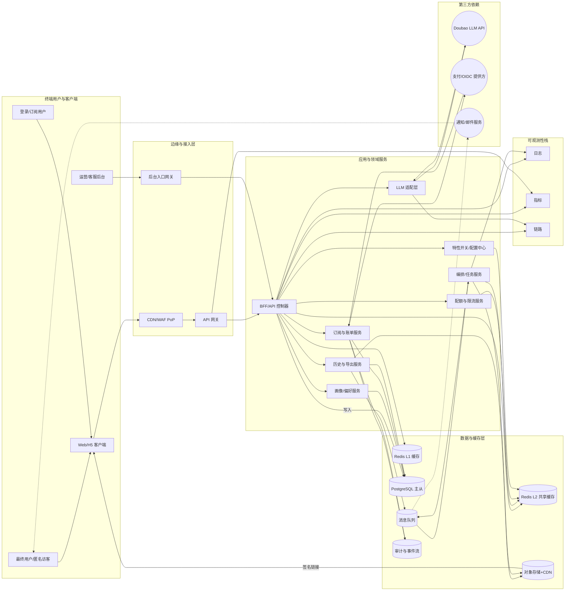

# Glancy 系统高层设计（HLD）

## 1. 目的与范围

- **目的**：在《需求说明文档》第 13/16/20 章约束下，沉淀对外部依赖、运行时拓扑、模块边界与核心数据流的共识，为详细设计（LLD）与交付计划提供输入。
- **范围**：面向 Web/H5 词典查词、再生成、历史、导出与订阅同步的后台系统；覆盖边缘/网关、BFF/应用单体、LLM 适配层、RDBMS、Redis、对象存储、任务编排、第三方依赖。
- **读者**：架构/后端/前端/QA/SRE，及外部集成方。LLD、Runbook 与测试方案以此为基线扩展。

## 2. 系统上下文

### 2.1 参与者与触点

| 角色/系统          | 交互入口                                              | 关注点                                                         |
| ------------------ | ----------------------------------------------------- | -------------------------------------------------------------- |
| 最终用户           | Web/H5/Embed 客户端                                   | 低延迟查词、再生成、导出、订阅权益可见、异常时可感知降级       |
| BFF/API 网关       | `/lookup`、`/regenerate`、`/history`、`/exports`      | 统一认证、限流、缓存、策略判定                                 |
| LLM 适配层         | Doubao API（defaultStream + fallbackStream）          | Prompt 裁剪、上下文注入、熔断与回退策略                        |
| 数据域（RDBMS）    | `lookups`, `results`, `profiles`, `subscriptions` 表  | ACID、读写分离、PITR（RTO ≤30 min/RPO ≤5 min）                 |
| Redis L1/L2        | 缓存查词结果、配额计数、feature flag                  | 命中率 ≥40%/≥20%，TTL 10/30 分钟，失效策略                     |
| 对象存储 + CDN     | 导出产物、多活 CRR、签名下载（TTL 10 分钟）           | 一次性链接、TTL 过期即失效、区域内 AZ 复制                     |
| 任务编排/消息队列  | 导出流水线、降级任务、合同回放 Job                    | 固定消费速率、失败重试与补偿                                   |
| 第三方（登录/支付）| OAuth2/OIDC、支付 Webhook                             | 订阅权益 ≤5 s 生效、一致性校验                                 |

### 2.2 图 1：系统上下文

- FigJam：<https://www.figma.com/file/glancy-sdd-figjam?type=whiteboard&node-id=230-1#SystemContext>
- Mermaid 源：`doc/系统设计文档/图/HLD-Context.mmd`



> 该图采用 C4 System Context 视角，展示最终用户、BFF、后台域及第三方依赖的信任边界、主要接口与数据流；源与快照集中维护于 `doc/系统设计文档/图/`。

## 3. 部署拓扑

### 3.1 运行层级

| 层级        | 形态与部署策略                                                                                                                                          |
| ----------- | ------------------------------------------------------------------------------------------------------------------------------------------------------- |
| 边缘/CDN/WAF| 多区域 PoP + 同区多 AZ；WAF+ACL 统一管理。                                                                                                             |
| API 网关    | Active-Active，容器化运行，自动扩缩容（<1 小时完成，参照第 16 章 16.3.5）。                                                                             |
| BFF/应用    | 单体+分模块包，运行在 Kubernetes/容器；无状态，支持蓝绿和小流量灰度（第 20 章 20.4）。                                                                 |
| LLM 适配层  | 独立 Deployment，通过 Service Mesh 暴露，支持独立扩缩容、限速及熔断。                                                                                   |
| 数据层      | RDBMS 主从 + 只读实例、Redis L1/L2 双集群、对象存储跨区域 CRR；对齐第 13 章 RTO/RPO。                                                                   |
| 编排与队列  | 任务编排服务 + 消息队列（导出/回放/补偿），跨 AZ 冗余。                                                                                                 |
| 可观测性    | Tracing（≥99% trace_id）、日志、指标统一，经由采集 Agent 上报（第 13 章 13.1.1、SLA 观测要求）。                                                       |

### 3.2 图 2：部署拓扑

- FigJam：<https://www.figma.com/file/glancy-sdd-figjam?type=whiteboard&node-id=230-100#Deployment>
- Mermaid 源：`doc/系统设计文档/图/HLD-Deployment.mmd`

```mermaid
%% FigJam: https://www.figma.com/file/glancy-sdd-figjam?type=whiteboard&node-id=230-100#Deployment
%% 源文件：doc/系统设计文档/图/HLD-Deployment.mmd
flowchart TB
    subgraph RegionA[Region A]
        subgraph AZ1[A Z 1]
            EdgeA1[CDN/WAF PoP]
            GW1[API 网关 Pod]
            BFF1[BFF Deployment]
            Adapter1[LLM 适配层]
            RedisL11[(Redis L1 Shard)]
        end
        subgraph AZ2[A Z 2]
            EdgeA2[CDN/WAF PoP]
            GW2[API 网关 Pod]
            BFF2[BFF Deployment]
            Adapter2[LLM 适配层]
            RedisL12[(Redis L1 Shard)]
        end
        subgraph DataA[数据层]
            RDBMSA[(RDBMS 主)]
            RedisL2A[(Redis L2 Cluster)]
            ObjA[(对象存储 Bucket A)]
        end
        subgraph OpsA[编排/可观测]
            MQ[消息队列]
            Orchestrator[任务编排]
            Observability[采集 Agent/监控]
        end
    end

    subgraph RegionB[Region B (Warm Standby)]
        RDBMSB[(RDBMS 备)]
        RedisL2B[(Redis L2 备)]
        ObjB[(对象存储 CRR 备份)]
    end

    EdgeA1 --> GW1 --> BFF1 --> Adapter1
    EdgeA2 --> GW2 --> BFF2 --> Adapter2
    GW1 --> RDBMSA
    GW2 --> RDBMSA
    BFF1 --> RedisL2A
    BFF2 --> RedisL2A
    Orchestrator --> MQ --> BFF1
    Orchestrator --> MQ --> BFF2
    ObjA --> CDNUser[CDN 分发导出链接]

    RDBMSA ==PITR/同步==> RDBMSB
    RedisL2A ==异步复制==> RedisL2B
    ObjA ==CRR==> ObjB
```

> 展示区域/AZ 关系、组件冗余、数据主从与流量切换路径（包括冷/热备、半自动切换 Runbook）；统一收敛到 `doc/系统设计文档/图/` 便于 FigJam 与 Mermaid 同步。

### 3.3 弹性与容灾要点

1. **SLA/SLO**：关键接口月度 ≥99.9%（第 13 章 13.1），首屏 P95 ≤2.5 s（第 16 章 16.3）。
2. **降级策略**：任意依赖 5xx ≥5% 持续 1 分钟触发，BFF 返回“基础释义 + 模板例句”并标记 `degraded=true`（第 13 章、20 章）。
3. **RTO/RPO**：历史/配置 RTO ≤30 min/RPO ≤5 min；导出任务 RTO ≤15 min（第 13 章 13.1.4）。
4. **扩缩容**：300 QPS 稳态 + 3 倍突发（第 16 章 16.3.5），容器层自动扩容、Redis 与适配层按速率阈值触发水平扩展。

## 4. 模块边界

### 4.1 边缘/网关

- 职责：TLS 终结、WAF/ACL、防抖、静态缓存；JWT/Session 校验、统一限速（用户/租户/全局三层 Token Bucket）。
- 出口：将合法请求转发至 BFF，附带 trace_id、配额头、客户端上下文。
- 异常：网关级 5xx 聚合上报，可触发流量开关或强制降级。

### 4.2 BFF/应用单体

| 能力           | 说明                                                                                                   |
| -------------- | ------------------------------------------------------------------------------------------------------ |
| 请求编排       | 聚合画像、订阅、配额、缓存命中结果，决定是否走 LLM 外呼或缓存命中（命中率目标 52%）。                 |
| 缓存策略       | L1（进程内/Redis Cluster 模式）TTL 10 分钟，L2 TTL 30 分钟，`X-Cache` 标记命中（第 20 章 20.3）。       |
| 流式渲染       | 采用 SSE/WebSocket 将模块化内容推送给前端；超 2.3 s 自动降级（第 16 章 16.4）。                         |
| 熔断与回退     | 包含 Doubao、RDBMS、Redis、对象存储依赖健康探针；触发时写入降级日志并通知可观测性系统。                |
| 写路径         | 历史、配额、导出任务等写操作经异步队列落地，主路径仅落幂等索引。                                       |

### 4.3 LLM 适配层

- 职责：构造 Doubao `defaultStream` 请求（Prompt 模板、温度/TopP、系统指令、对话上下文）、监控响应流、实现 fallback（fallbackStream 或 BFF 降级）。
- 接口：gRPC/HTTP 双栈；暴露内部 `/v1/compose`（同步流式）与 `/v1/replay`（用于默认答案更新）。
- 可靠性：外呼超时 5 s、P95 ≤3 s；熔断窗口 60 s；半开探测 5% 采样。

### 4.4 数据存储

| 组件        | 关键设计                                                                                                  |
| ----------- | --------------------------------------------------------------------------------------------------------- |
| RDBMS       | 主从 + 只读，采用 GTID 复制；事务隔离级别 READ COMMITTED；支持 PITR；历史/订阅/订单共享 schema。        |
| Redis L1/L2 | L1（本地节点 + 哨兵）；L2（共享集群）；提供计数器、Feature Flag、缓存；过期事件驱动异步刷新。            |
| 对象存储    | 版本化 + 10 分钟 TTL 签名；导出产物采用 AES-256 服务端加密，跨区域冗余（CRR）。                          |

### 4.5 任务编排与消息队列

- 负责导出流水线、契约回放、缓存刷新任务；提供幂等 Job ID、指数回退重试、死信队列。
- 导出任务 SLA：回执 ≤5 s、任务整体 RTO ≤15 min（第 13 章）。

### 4.6 第三方依赖

- 登录：OIDC，token 通过 API 网关验证；失败走匿名模式。
- 支付：Webhook → BFF Webhook 接口 → 订阅/配额域；权益 ≤5 s 生效（第 20 章 20.3）。

## 5. 数据流与接口一致性

1. **查词主链路**：用户→网关→BFF（鉴权/配额/缓存命中）→[命中] 直接返回；[未命中] 调用 LLM 适配→Doubao→流式回传→缓写历史/缓存。
2. **Doubao 回退**：默认 `defaultStream`；遇到 4xx/5xx/超时→触发 fallback（缓存模板、`defaultStream` 重试 1 次、或返回降级内容）。
3. **配额/订阅**：请求头包含 `Idempotency-Key`；BFF 先查 Redis 计数与订阅快照，不一致时从 RDBMS 更新并写回（详见 LLD 模块）。
4. **导出流水线**：同步接口仅入列 + 返回回执；异步任务消费→查询数据→生成 CSV/JSON→上传对象存储→回执包含签名链接（TTL 10 分钟）。
5. **可观测性**：trace_id 自网关注入并贯穿；关键指标（SLA/SLO、缓存命中、熔断、导出 RTO/RPO）均写入指标平台，满足第 20 章 20.14。

## 6. 对 SRS 第 13/16/20 章的遵循

- **第 13 章（可用性/容灾）**：多 AZ/区域部署、缓存降级策略、RTO/RPO 标准、导出 RTO ≤15 min；降级响应率 100%。
- **第 16 章（性能/容量）**：段内预算（网关 ≤150 ms、BFF ≤180 ms、LLM 外呼≤3 s）、缓存命中目标、2.3 s 超时降级、300 QPS + 3×突发扩缩容。
- **第 20 章（验收/测试）**：SLO 与验收门槛写入 HLD；导出 TTL 10 分钟、订阅权益 ≤5 s、一致性校验、可观测性与发布清单嵌入设计。

## 7. 图与 artefact 索引

| 图 ID  | 描述                         | 图源                                   | 渲染方式                               | FigJam 链接片段 |
| ------ | ---------------------------- | -------------------------------------- | -------------------------------------- | ---------------- |
| HLD-CTX| 系统上下文                   | `doc/系统设计文档/图/HLD-Context.mmd`               | Mermaid 代码块                         | `node-id=230-1` |
| HLD-DEP| 部署拓扑与容灾               | `doc/系统设计文档/图/HLD-Deployment.mmd`           | Mermaid 代码块                         | `node-id=230-100` |
| SEQ-LK | 查词与流式渲染主时序         | `doc/系统设计文档/图/LLD-Lookup-Sequence.mmd`      | Mermaid 代码块                         | `node-id=230-20` |
| SEQ-EX | 历史导出与一次性链接时序     | `doc/系统设计文档/图/LLD-Export-Pipeline.mmd`      | Mermaid 代码块                         | `node-id=230-40` |
| SEQ-LLM| Doubao 请求构造与回退时序    | `doc/系统设计文档/图/LLD-Doubao-Sequence.mmd`      | Mermaid 代码块                         | `node-id=2-200` |
| FLOW-QUOTA| 配额/订阅一致性流程       | `doc/系统设计文档/图/LLD-Quota-Flow.mmd`           | Mermaid 代码块                         | `node-id=2-300` |
| ER-CORE| 核心数据域 ER（账户/查词/导出)| `doc/图/src/er-core.mmd`                            | Mermaid 代码块                         | `node-id=230-80` |
| T29-GT | T29 制图交付甘特图           | `doc/图/src/gantt-t29.mmd`                           | Mermaid 代码块                         | `node-id=230-140` |

> 维护统一入口：见 `doc/图/README.md`。所有图的 FigJam 权限需保持“Anyone with the link → can view/comment”。
