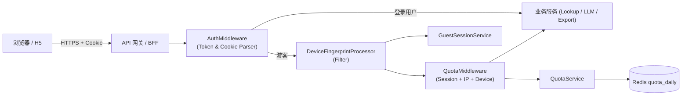
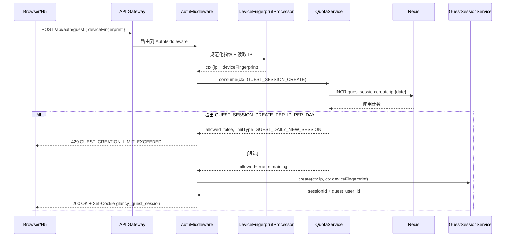
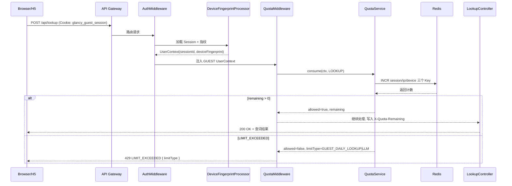

# 模块：游客鉴权与多维配额中间件

> 目的：统一 HttpOnly Cookie → `UserContext` 的解析、游客会话创建、以及“会话/IP/设备指纹/新建会话”四维配额的校验，避免在各个业务控制器中散落 `if (isGuest)` 判断。游客身份的能力边界以 SRS [2.9](../../需求说明文档/第 2 章 产品范围与目标.md#29-用户身份与模式定义) 为唯一 SSoT，本 LLD 仅描述落地方式。

## 1. 架构模块视图与 `UserContext`

### 1.1 模块图



- 游客请求路径：浏览器或 H5 通过 API 网关进入 → `AuthMiddleware` 无 Bearer Token 时把请求交给 `DeviceFingerprintProcessor` 解析 HttpOnly Cookie / 请求体内的 `deviceFingerprint`，构建 `UserContext` → `QuotaMiddleware` 调用 `QuotaService`，以 `session + ip + device` 三维计数 + Redis 存储比对阈值 → 请求才会进入业务服务。
- 登录用户路径：`AuthMiddleware` 校验 JWT，直接注入 `UserContext` 并透传（跳过 `QuotaMiddleware`）。
- `DeviceFingerprintProcessor` 负责强制 `deviceFingerprint`（见 SRS 12.4.2）和 IP 绑定，`guest_session` 缺失或过期会统一返回 `401 GUEST_SESSION_REQUIRED`。

### 1.2 身份类型与处理路径

| `userType` | 入口 / 触发 | 鉴权路径 | 配额策略 | 备注 |
| --- | --- | --- | --- | --- |
| `GUEST` | `POST /api/auth/guest`（BFF 到后端 `/api/v1/sessions/guest` 的别名）+ 携带 `glancy_guest_session` 的后续请求 | `AuthMiddleware` → `DeviceFingerprintProcessor` → `GuestSessionService`，构建 `guest_user_id` + `sessionId` | 执行 `QuotaMiddleware` 与 `QuotaService`，命中 `session/ip/device` 的 `LOOKUP` 或 `LLM` 限额，以及 `GUEST_SESSION_CREATE_PER_IP_PER_DAY` | 仅可访问查词、`POST /api/llm/chat` 等在 SRS 12.4.1 列表内的游客态能力 |
| `FREE_USER` | 登录态 JWT（邮箱 / OAuth） | `AuthMiddleware` 校验 JWT 并注入 `userId`，跳过 `DeviceFingerprintProcessor` | 使用订阅域配额（不再走游客管道） | 可以访问收藏、生词本等需要身份的功能 |
| `PLUS_USER` | 与 `FREE_USER` 相同 | 同上 | 同上 | 享受更高订阅阈值、更多导出能力 |
| `PRO_USER` | 与 `FREE_USER` 相同 | 同上 | 同上 | 具备最高配额与导出能力；游客中间件完全绕过 |

### 1.3 `UserContext` 结构

```ts
type UserType = 'GUEST' | 'FREE_USER' | 'PLUS_USER' | 'PRO_USER'

type QuotaType = 'LOOKUP' | 'LLM' | 'GUEST_SESSION_CREATE'

interface UserContext {
  userType: UserType          // 统一使用 SRS 2.9 枚举
  userId: string              // 登录用户 ID；游客为 guest_user_id
  ip: string                  // 来源 IP，含 CIDR 解析
  deviceFingerprint?: string  // 游客必传，详见 SRS 12.4.2
  requestId: string           // trace_id / request_id
  sessionId?: string          // 游客 cookie 中的 session
  quota: {
    lookupRemaining?: number
    llmRemaining?: number
  }
}
```

> `AuthMiddleware` → `DeviceFingerprintProcessor` 负责构建 `UserContext`，`QuotaMiddleware` 仅当 `userType = 'GUEST'` 时读取 `UserContext` 继续扣减配额；若没有 Bearer Token 也没有 Cookie，则在进入业务服务前返回 `401 GUEST_SESSION_REQUIRED`。

## 2. 鉴权流水线（伪代码）

```pseudo
function GuestAuthFilter(request):
  ctx = new UserContext()
  ctx.ip = extractIp(request)
  ctx.requestId = request.headers['X-Request-Id'] || genId()

  if hasBearerToken(request):
    ctx.userType, ctx.userId = validateJWT(request)
    return Proceed(ctx)

  // 游客路径
  cookie = request.cookies['glancy_guest_session']
  if request.path in ['/api/v1/sessions/guest', '/api/auth/guest']: // /api/auth/guest 为 API 网关别名
    fingerprint = deviceFingerprintProcessor.require(request.body.deviceFingerprint, ctx.ip)
    decision = quotaService.consume(ctx, QuotaType.GUEST_SESSION_CREATE)
    if decision.allowed == false:
      return 429 GUEST_CREATION_LIMIT_EXCEEDED { limitType: decision.limitType }
    session = guestSessionService.create(ctx.ip, fingerprint)
    setHttpOnlyCookie('glancy_guest_session', session.id, ttl=72h)
    ctx.userType = 'GUEST'; ctx.userId = session.guestUserId; ctx.sessionId = session.id; ctx.deviceFingerprint = fingerprint
    return Proceed(ctx)

  if cookie is null:
    return 401 { code: 'GUEST_SESSION_REQUIRED' }

  session = guestSessionService.load(cookie)
  if session.expired:
    return 401 { code: 'GUEST_SESSION_EXPIRED' }

  ctx.userType = 'GUEST'
  ctx.userId = session.guestUserId
  ctx.sessionId = session.id
  ctx.deviceFingerprint = session.deviceFingerprint
  return Proceed(ctx)
```

要点：

- `/api/v1/sessions/guest` 是唯一允许无 Cookie 的游客接口；其他接口必须带上已有 Cookie。
- 设备指纹缺失时默认返回 `DEVICE_FINGERPRINT_REQUIRED`，除非特性开关允许临时降级（记录 `quota_events` 并返回 `X-Quota-Warning`）。

## 3. 多维配额中间件

```pseudo
function MultiDimQuotaMiddleware(request, ctx):
  if ctx.userType != 'GUEST':
    return Proceed()

  metric = resolveMetric(request.path) // lookup | llm | export (只对查词/LLM 计费)
  result = quotaService.consumeGuestQuota(
              sessionId=ctx.sessionId,
              guestUserId=ctx.userId,
              ip=ctx.ip,
              deviceFingerprint=ctx.deviceFingerprint,
              metric=metric)

  if result.allowed == false:
    return 429 LIMIT_EXCEEDED { limitType: result.limitType }

  ctx.quota.lookupRemaining = result.sessionRemaining
  request.attributes['UserContext'] = ctx
  return Proceed()
```

`QuotaService` 由以下步骤组成，作为可复用的应用服务（而非散落在 Controller）：

1. 组装 Redis key  
   - `guest:quota:session:{sessionId}:{metric}:{date}`  
   - `guest:quota:ip:{ip}:{metric}:{date}`  
   - `guest:quota:device:{deviceFingerprint}:{metric}:{date}`
   - `guest:session:create:ip:{ip}:{date}`（仅 `QuotaType = GUEST_SESSION_CREATE`）
2. 使用 `INCR` + `EXPIRE`（TTL=1 日）更新对应 Key（`session/ip/device` 或 `session_create`）。
3. 计算剩余额度：`remaining = limit - used`；汇总到 `session/ip/device`。
4. 返回 `allowed = min(remaining) > 0`，以及 `limitType`（`GUEST_DAILY_LOOKUP` / `GUEST_DAILY_LLM`）。

> `/api/v1/sessions/guest` 只走“新建会话配额”路径，不进入多维业务配额；查词/LLM 接口一定经过该中间件。

### 3.1 `QuotaService` 接口定义

```ts
type QuotaDecision = {
  allowed: boolean
  limitType: 'GUEST_DAILY_LOOKUP' | 'GUEST_DAILY_LLM' | 'GUEST_DAILY_NEW_SESSION'
  blockedDimension?: 'session' | 'ip' | 'device'
  remaining: {
    session?: number
    ip?: number
    device?: number
  }
  resetAt: string              // ISO 字符串，指向下一次自然日重置时间
}

interface QuotaService {
  consume(ctx: UserContext, quotaType: QuotaType): QuotaDecision
}
```

`QuotaMiddleware` 调用 `consume`，**仅当 `allowed = true` 时**把 `remaining.session` 等写回 `UserContext.quota`，否则立刻返回 `429 LIMIT_EXCEEDED`。

### 3.2 算法描述

1. 输入：`UserContext`（含 sessionId/ip/deviceFingerprint） + `QuotaType (LOOKUP|LLM|GUEST_SESSION_CREATE)`。
2. 计算当日日期戳（本地自然日），构造 Redis Key：
   - `LOOKUP/LLM`：同时构造 `session/ip/device` 三个 Key；若 `deviceFingerprint` 缺失则落 `quota_events` 并附加 `X-Quota-Warning: device_fingerprint_missing`。
   - `GUEST_SESSION_CREATE`：仅构造 `guest:session:create:ip:{ip}:{date}`。
3. 使用 `MULTI` + `INCR` 并设置 `EXPIRE=24h`，保证“读→改→写”在单个 Redis 循环内完成。
4. 根据 `quotaType` 将 Redis 计数映射到 `limitType`：`LOOKUP` → `GUEST_DAILY_LOOKUP`，`LLM` → `GUEST_DAILY_LLM`，`GUEST_SESSION_CREATE` → `GUEST_DAILY_NEW_SESSION`。
5. 对 `remaining` 求最小值。`allowed = min(remaining) > 0`，并标识最先触顶的 `blockedDimension`（便于运维观测）。
6. 输出：`QuotaDecision`，同时把 `resetAt` 设为当日 23:59:59 本地时区；若 `allowed=false`，`limitType` 将透传给前端。

### 3.3 配额阈值（与 SRS 12.4.1 保持一致）

| 维度（键） | 指标 | 每日上限 | 说明 / 来源 |
| --- | --- | --- | --- |
| `guest_user_id`（会话级） | `LOOKUP_PER_SESSION_PER_DAY` | 20 次 | 同 SRS 12.4.1 “会话级查词” |
|  | `LLM_PER_SESSION_PER_DAY` | 5 次 | 涵盖例句再生成等高成本 LLM 调用 |
| `client_ip`（IP 级） | `LOOKUP_PER_IP_PER_DAY` | 60 次 | 防止单一 IP 横向扩展游客会话 |
|  | `LLM_PER_IP_PER_DAY` | 15 次 | 包含所有浏览器实例 |
| `device_fingerprint`（设备级） | `LOOKUP_PER_DEVICE_PER_DAY` | 60 次 | 指纹生成规则见 SRS 12.4.2 |
|  | `LLM_PER_DEVICE_PER_DAY` | 15 次 | 与 IP 阈值相同，识别频繁清 Cookie |
| `client_ip`（会话创建） | `GUEST_SESSION_CREATE_PER_IP_PER_DAY` | 5 次 | 限制 `POST /api/auth/guest` / `/api/v1/sessions/guest` 调用频率 |

> 当系统需要调整阈值时，需同步更新 `doc/需求说明文档/第 12 章 安全、隐私与合规.md#1241-guest-multiquota`，避免出现多版本 SSoT。

## 4. 流程与时序

### 4.1 游客请求流程（组件级）

```mermaid
flowchart TD
    A[浏览器 / H5 请求] --> B[API 网关]
    B --> C[AuthMiddleware]
    C -->|Bearer Token 有效| Z[注入 UserContext → 业务控制器]
    C -->|无 Token| D[DeviceFingerprintProcessor\n读取 Cookie + 指纹]
    D --> E{路径 == /api/auth/guest?}
    E -->|是| F[QuotaService 检查\nGUEST_SESSION_CREATE]
    F -->|超限| R1[429 GUEST_CREATION_LIMIT_EXCEEDED]
    F -->|通过| S[GuestSessionService\n生成 session & Cookie]
    S --> Z
    E -->|否| G{Cookie glancy_guest_session 存在?}
    G -->|否| R2[401 GUEST_SESSION_REQUIRED]
    G -->|是| H[加载 Session\n绑定 deviceFingerprint]
    H --> I[QuotaMiddleware\n(metric=lookup/llm)]
    I --> J[QuotaService\nsession/ip/device 计数]
    J -->|超限| R3[429 LIMIT_EXCEEDED\n(GUEST_DAILY_LOOKUP / LLM)]
    J -->|通过| Z
```

### 4.2 游客首次访问 + `/api/auth/guest`（创建会话）



### 4.3 游客查词 / 多维配额检查



> `/api/auth/guest` 是 API 网关在 BFF 层暴露的路由，后端依然复用 `/api/v1/sessions/guest` 控制器；`QuotaService` 的三次 INCR + 统一响应保证游客请求能携带剩余额度、或明确返回 `GUEST_DAILY_LOOKUP`/`LLM`/`NEW_SESSION` 的可见错误。

## 5. 接入约束

- 中间件顺序：`AuthMiddleware`（JWT / Cookie）→ `DeviceFingerprintProcessor` / `GuestSessionService`（落指纹 + session）→ `MultiDimQuotaMiddleware`（调用 `QuotaService.consume`）→ 业务 Controller。
- 所有新业务接口若需要游客能力，必须声明是否计入 `lookup` 或 `llm` metric，并复用 `QuotaService.consume(UserContext, QuotaType)`；禁止在 Controller 内直接 `INCR`。
- 日志：以上 Middleware 在拒绝请求时，统一记录 `trace_id`、`quotaType`、`blockedDimension`、`limitType`、`sessionId`、`ip`、`deviceFingerprint`，并写入 `quota_events`，便于对齐 SRS 12.4.1 的审计要求。

## 6. 用户故事与验收标准（游客体验 + 风控诉求）

### US-01 `GUEST` 游客即时查词

- **角色**：只想临时查词、不愿注册的 `GUEST`。
- **目标**：无需登录即可在同一浏览器中完成 20 次查词与 5 次 LLM 调用（SRS 12.4.1 会话维度），且触顶提示清晰。
- **价值**：降低首次访问摩擦，同时在配额耗尽时引导升级账号。
- **验收标准**：
  - 条件：游客会话当天 `lookup` 次数 < 20；动作：发起查词请求；结果：HTTP 200，响应体附带 `UserContext.quota.lookupRemaining`，UI 不弹登录框。
  - 条件：同一 `guest_user_id` 当天已查词 20 次；动作：发起第 21 次查词；结果：返回 429 `LIMIT_EXCEEDED` + `limitType=GUEST_DAILY_LOOKUP`，前端 toast 显示“今日游客查词 20 次已用完”并提供注册入口。
  - 条件：同一 `guest_user_id` 当天已调用 LLM 5 次；动作：发起第 6 次 LLM 请求；结果：返回 429 `LIMIT_EXCEEDED` + `limitType=GUEST_DAILY_LLM`，UI 同样提示“游客每日 LLM 5 次”并附带注册 CTA。

### US-02 产品负责人——游客成本可控

- **角色**：负责 DAU 与成本的产品负责人 / 运营。
- **目标**：确保游客每天 20 / 5（会话级）与 60 / 15（IP & 设备指纹级）硬阈值生效，配额命中后可观测、可引导转化。
- **价值**：防止游客滥用导致 LLM 成本失控，同时将“注册升级”作为自然下一步。
- **验收标准**：
  - 条件：同一 `client_ip`（可能包含多个 `guest_user_id`）当天已累计 60 次查词；动作：任意游客再查词；结果：返回 429 `LIMIT_EXCEEDED` + `limitType=GUEST_DAILY_LOOKUP`，`quota_events` 记录 `dimension=ip`，UI 文案提示“IP 每日 60 次已用尽，请注册以解锁更多”。
  - 条件：同一 (`client_ip`, `deviceFingerprint`) 组合当天 LLM 次数达 15；动作：任意游客再触发 LLM；结果：返回 429 `LIMIT_EXCEEDED` + `limitType=GUEST_DAILY_LLM`，日志写入 `dimension=device`，UI 引导注册/登录。
  - 条件：任一游客命中配额；动作：前端读取 `UserContext.quota` / 错误码；结果：展示“今日剩余 X/20 查词、Y/5 LLM”或“配额为 20/5/60/15”提示，并附注册按钮，无需依赖人工公告。

### US-03 后端工程师——多维计数 & 防清 Cookie

- **角色**：实现游客鉴权与配额服务的后端工程师。
- **目标**：在会话、IP、设备指纹三维度同步计数，缺失指纹时按 SRS 12.4.2 的降级策略处理，杜绝通过清 Cookie 无限刷新配额。
- **价值**：技术实现对齐业务诉求，避免被视为“纯技术细节”而缺失验收。
- **验收标准**：
  - 条件：请求 `POST /api/v1/sessions/guest` 未携带 `deviceFingerprint`；动作：发起会话创建；结果：默认返回 `DEVICE_FINGERPRINT_REQUIRED` 错误，日志标记缺失维度；若临时放宽特性开关打开，则仍需写入 `quota_events`（`dimension=device_missing`）并返回 `X-Quota-Warning: device_fingerprint_missing`。
  - 条件：同一 `deviceFingerprint` + `client_ip` 当天已查词 60 次；动作：用户清除 Cookie 后重建会话并再查词；结果：即刻返回 429 `LIMIT_EXCEEDED` + `limitType=GUEST_DAILY_LOOKUP`，证明清 Cookie 不能绕过 IP/设备限制。
  - 条件：游客查词请求被受理；动作：`QuotaService.consumeGuestQuota` 扣减配额；结果：一次请求同时命中 `session/ip/device` 三个 Redis Key，任何一个达到 0 时中止后续业务逻辑并记录 `limitType`。

### US-04 安全 / 风控——限制游客会话滥建

- **角色**：负责防止脚本批量刷号的安全 / 风控成员。
- **目标**：同一 IP 每天最多 5 次 `POST /api/v1/sessions/guest`（SRS `GUEST_SESSION_CREATE_PER_IP_PER_DAY`），并在触顶时抛出明确错误码。
- **价值**：降低游客脚本批量造访成本，保护配额服务免受横向扩张攻击。
- **验收标准**：
  - 条件：某 `client_ip` 当天创建次数 < 5；动作：发起游客会话创建；结果：返回 201，`glancy_guest_session` HttpOnly Cookie 写入成功。
  - 条件：同一 IP 当天已创建 5 个游客会话；动作：第 6 次调用 `POST /api/v1/sessions/guest`；结果：返回 429 `GUEST_CREATION_LIMIT_EXCEEDED`，响应体包含剩余解封时间，前端弹窗提示“今日该 IP 仅可创建 5 个游客会话”并推荐注册。
  - 条件：命中新建会话配额；动作：风控指标订阅 `quota_events`；结果：仪表盘可按 `client_ip` 聚合“GUEST_CREATION_LIMIT_EXCEEDED”计数，触发告警或动态封禁策略。

## 6. 监控与可观测性

游客模式属于高风险入口，监控面板必须具备“发现异常流量、量化游客成本、快速定位 429 投诉”三类能力。以下指标与告警配置直接沉淀在 Observability 文档中，Grafana Panel「Auth & Quota / Guest Overview」可按表格信息配置，无需重新设计字段。

### 6.1 指标设计

| 指标 | 描述 | 指标来源（字段） | 更新频率 / 展示位置 |
| --- | --- | --- | --- |
| 身份类型 QPS | API QPS 按 `userType ∈ {GUEST, FREE_USER, PLUS_USER, PRO_USER}` 拆分，支持 drilldown 到接口/区域。 | `api_gateway_requests` 日志：`user_type`、`path`、`region`; 由 `Auth Filter` 注入。 | 60s 滚动；Grafana → Auth & Quota / Guest Overview → 「Traffic by Identity」图层。 |
| 日游客查词总次数 | 游客 Lookup 成功调用量，用于评估字典接口成本与配额策略。 | `quota_events`（`metric=lookup` 且 `decision=allow`）字段：`guest_user_id`、`session_id`、`ip`。 | 每日; 业务监控大盘「Guest Lookup Cost」。 |
| 日 LLM 调用总次数（游客 vs 非游客） | 对比游客与登录用户 LLM 消耗，辅助容量规划。 | `llm_invocation_log` 埋点：`user_type`、`model_name`、`tokens_used`。 | 1 小时汇总；Grafana → LLM Ops / Consumption。 |
| `LIMIT_EXCEEDED` 触发次数 | 游客业务配额被拒绝的频次按 `limitType` 维度展示。 | `quota_events`：`decision=deny`、`code=LIMIT_EXCEEDED`、`limit_type`、`ip`、`device_fingerprint`。 | 5 分钟滚动 + 每日累计；Grafana → Auth & Quota / Guest Overview → 「Quota Deny」表。 |
| `GUEST_CREATION_LIMIT_EXCEEDED` 触发次数 | 游客新建会话受限情况，区分 IP/指纹维度。 | `guest_session_events`：`code=GUEST_CREATION_LIMIT_EXCEEDED`、`ip`、`device_fingerprint`。 | 5 分钟滚动 + 每日累计；Grafana 同上「Session Creation」图。 |
| Top IP / 设备指纹调用量 | 最近 5 分钟请求量 TopN，展示 IP、设备指纹、地域，辅助定位攻击来源。 | `api_gateway_requests` + `quota_events` join：`ip`、`device_fingerprint`、`region`、`request_count`。 | 5 分钟窗口实时刷新；Grafana → Guest Overview → 「Top Actors」表格。 |

> `api_gateway_requests` 与 `quota_events` 都进入 Loki，Grafana 以 `sum_over_time(count by (...) [window])` 方式聚合；`llm_invocation_log` 通过 ClickHouse 物化视图暴露给同一大盘。

### 6.2 告警规则

- **Guest IP/Fingerprint Traffic Spike**  
  - 规则：任意 `ip` 或 `device_fingerprint` 在 5 分钟内的请求数 > max(前 1 小时 P95 × 2, 2000)。  
  - 数据：`api_gateway_requests`，按身份筛选 `user_type='GUEST'`。  
  - 通知：PagerDuty「Guest-Anti-Abuse」以及 Slack `#alert-guest`，附 Top Path 与 Region 方便一键封禁。

- **Limit Exceeded Surge**  
  - 规则：`quota_events` 中 `code=LIMIT_EXCEEDED` 在 5 分钟窗口环比上一小时平均增长 300% 以上，或绝对值 > 1000。  
  - 告警内容：包含 `limit_type` 拆分图、Top Session/IP/指纹信息，方便定位“配额过紧” vs “恶意刷接口”。

- **Guest Creation Failure Surge**  
  - 规则：`guest_session_events` 中 `code=GUEST_CREATION_LIMIT_EXCEEDED` 或 `code=DEVICE_FINGERPRINT_REQUIRED` 的 10 分钟滑动平均 > 上一日同时间段 200%。  
  - 作用：能快速发现设备指纹校验 bug、IP 限流配置过小等问题；附带最近 20 条请求的 `device_fingerprint` Hash 与 UA。

所有告警均提供跳转链接到 Grafana Panel 以及 Loki 查询模板，值班同学可直接复刻查询；面板默认展示“指标来源 / 刷新频率 / 上次更新”信息，满足审计对数据链路透明度的要求。

## 6. 游客配额与风控缓存模型（DB / Cache）

### 6.1 存储原则

- 游客配额计数只使用 Redis（或等价的内存型 KV），通过 `INCR` + `EXPIRE` 构造自然日粒度的配额桶，不落地到任何关系型数据库表。
- 风控事件（新建会话、查词、LLM）均基于“自然日”窗口，所有计数 key 的 TTL 固定为 1 天。Redis 负责自动清理过期 key，无需额外作业。
- 由于计数是瞬态数据，持久化数据库仅维护游客 session 元数据；配额计数失效后重新计算即可。

### 6.2 Key 命名与 TTL

- 查词配额（`lookup` metric）使用以下 key：
  - `guest:quota:session:{guest_user_id}:lookup:{date}`
  - `guest:quota:ip:{ip}:lookup:{date}`
  - `guest:quota:device:{device_fingerprint}:lookup:{date}`
- LLM 配额共享同样的命名模式，只把 `lookup` 替换为 `llm`。
- 游客创建风控：
  - `guest:quota:ip:{ip}:guest_create:{date}`：限制同一 IP 当日允许的新建游客会话数。
- 所有 key 默认 TTL = 1 天，生成策略是首次 `INCR` 时同步 `EXPIRE key 86400`，再次访问只续约而不修改 TTL，确保周期与自然日对齐。

### 6.3 历史记录写入策略

- “查词历史表”（`word_lookup_history`）只允许 `FREE_USER` / `PLUS_USER` / `PRO_USER` 的 `user_id` 插入，主键依赖登录用户 ID + 时间线。
- 游客请求不会也不允许写入上述历史表；多维计数完全由 Redis key 承担，用于速率限制而非审计。
- 若后续有需求追踪游客行为，需新增单独的宽表或日志流，而不是复用现有用户历史模型。

### 6.4 Redis 容量估算

| 假设 | 数值 |
| --- | --- |
| 日活游客数（DAU） | 300k |
| 人均查词次数 | 10 次/天 |
| 人均新建游客会话 | 1 次/天 |
| IP 去重比例 | 80%（≈240k IP） |
| 设备指纹去重比例 | 90%（≈270k 设备） |

- lookup/llm 维度 key 数 ≈ session 300k + IP 240k + device 270k ≈ 810k/metric；考虑 lookup 与 llm 共享 50% 用户，取 1.0M key/day。
- 新建会话配额 key ≈ 240k（按 IP 维度）。
- 合计 Redis key 约 1.25M；假设每个 key/value + 元数据 ≈ 120B，则占用 ≈ 150MB，预留 30% buffer 后 < 200MB，可落在单分片内存预算。
- 若 DAU 上升至 1M，则线性扩展占用 ≈ 500MB，需要扩容 Redis Cluster 或下沉部分维度（如 device）到分片。

> 以上估算为架构评审的性能/成本输入，实际部署阶段可基于观测数据回调 TTL 或维度拆分策略。

## 6. API 规范（Guest 模式对齐）

### 6.1 `POST /api/auth/guest`

- **用途**：创建游客会话（等同于之前的 `/api/v1/sessions/guest`），发放 `glancy_guest_session` HttpOnly Cookie。
- **请求体**（JSON，必传 `deviceFingerprint`，缺失时返回 400 `DEVICE_FINGERPRINT_REQUIRED`）：

```json
{
  "deviceFingerprint": "8df0c7f8-0102-4434-bf1e-guest-web",
  "locale": "zh-CN" // 可选，方便埋点
}
```

- **成功响应**：`201 Created`，同时 `Set-Cookie: glancy_guest_session=<sessionId>; HttpOnly; Secure; Path=/; Max-Age=259200`。

```json
{
  "guestUserId": "guest_9c0a377c",
  "sessionId": "gs_12c11f24",
  "expiresAt": "2024-05-04T12:00:00Z"
}
```

- **错误响应**（配额命中 IP / Device / Session 创建阈值时）：`429 Too Many Requests`。

```json
{
  "errorCode": "GUEST_CREATION_LIMIT_EXCEEDED",
  "limitType": "GUEST_DAILY_NEW_SESSION",
  "message": "Guest session creation quota exceeded"
}
```

### 6.2 `POST /api/lookup`

- **支持身份**：`GUEST` / `FREE_USER` / `PLUS_USER` / `PRO_USER` 均可调用，游客会走 `lookup` 配额。
- **请求体**：沿用查词 JSON（省略），游客必须通过前置的 Session/Cookie 建立 `UserContext`。
- **成功响应**：`200 OK`，附带查词结果以及 `X-Quota-Remaining: lookup=<number>`（供前端展示剩余额度）。
- **错误响应（配额超限）**：`429 Too Many Requests`，统一结构，方便前端判定。

```json
{
  "errorCode": "LIMIT_EXCEEDED",
  "limitType": "GUEST_DAILY_LOOKUP",
  "message": "Guest lookup quota exceeded"
}
```

### 6.3 LLM API

- **接口划分**：
  - `POST /api/llm/chat` → 标准聊天 / QA，支持 `GUEST`，命中 `llm` 配额后返回 429 `LIMIT_EXCEEDED` + `limitType = "GUEST_DAILY_LLM"`。
  - `POST /api/llm/translate-long`、`/api/llm/export` 等高成本能力 → 仅 `FREE_USER+`（即 `FREE_USER` / `PLUS_USER` / `PRO_USER`）。
- **游客被拒绝时的错误响应**：`403 Forbidden`，错误码固定为 `FORBIDDEN_FOR_GUEST`，同时 `limitType` 也写死为 `FORBIDDEN_FOR_GUEST` 以保持前端解析结构一致。

```json
{
  "errorCode": "FORBIDDEN_FOR_GUEST",
  "limitType": "FORBIDDEN_FOR_GUEST",
  "message": "Guest users cannot access /api/llm/translate-long",
  "hint": "Upgrade to Free or above to continue"
}
```

- **其他错误**：仍沿用统一响应 envelope（`errorCode` + 可选 `limitType` + `message`）。

## 7. API 权限矩阵

| 接口 | GUEST | FREE_USER | PLUS_USER | PRO_USER |
| --- | --- | --- | --- | --- |
| `POST /api/auth/guest` | ✅（仅用于初始化，会话间隔受限） | ⚠️（无意义；调用将返回 409 ALREADY_AUTHED） | ⚠️（同上） | ⚠️（同上） |
| `POST /api/lookup` | ✅（lookup 配额限制） | ✅ | ✅ | ✅ |
| `POST /api/llm/chat` | ✅（llm 配额限制，禁止高成本参数 `mode=turbo`） | ✅ | ✅ | ✅ |
| `POST /api/llm/translate-long` | ❌（返回 403 FORBIDDEN_FOR_GUEST） | ✅（限速较高） | ✅ | ✅ |
| `POST /api/llm/export` | ❌（高成本） | ⚠️（仅基础导出） | ✅（允许高级导出模板） | ✅ |

> ✅ = 允许；❌ = 禁止；⚠️ = 部分允许，需结合参数或当前登录态二次校验。矩阵与 SRS 中 `UserType` 枚举完全一致，新增接口时必须同步补全本表。

## 8. 游客用例说明书（Use Case Specification）

### <a id="uc-g1"></a>UC-G1 游客首次访问并完成第一次查词

**参与者**：主要 `GUEST`，次要 系统。  
**前置条件**：浏览器中无 `glancy_guest_session`，仅可用游客 Cookie；`GUEST` 未登录。  
**触发事件**：`GUEST` 打开站点并输入第一个查词请求。

**基本流程**
1. `GUEST` 首次进入站点，前端检测到缺少 HttpOnly Cookie，并通过设备指纹初始化游客态。
2. 前端调用 `/api/v1/sessions/guest`，传入 IP 与 `deviceFingerprint` 以请求新游客会话。
3. `GuestAuthFilter` 校验新建游客会话配额并生成 `sessionId` 与 `guest_user_id`，浏览器获得新的 `glancy_guest_session` Cookie。
4. `GUEST` 输入查词请求，前端携带 Cookie 调用查词接口。
5. `MultiDimQuotaMiddleware` 使用 `lookup` metric 扣减配额，`QuotaService` 更新 Redis 计数并返回剩余额度。
6. 控制器返回查词结果与剩余次数（例如 `X-Quota-Remaining-lookup`），前端展示结果并缓存剩余额度。

**备选 / 异常流程**
- `429 GUEST_CREATION_LIMIT_EXCEEDED`：步骤 2 触发新建会话限制时，前端弹出“今日游客访问次数已达上限”的提示，提供 `登录` / `注册` CTA 并阻止继续查词（参见 UC-G4）。
- `429 LIMIT_EXCEEDED`：若所查词请求与 LLM 解析合并返回超限，前端沿用 UC-G3 的提示模块，展示 CTA 引导登录。
- 网络或 API 错误：包括 `DEVICE_FINGERPRINT_REQUIRED`、`5xx` 等，前端展示重试按钮并记录埋点，用户可点击重试或改用登录流程。

### <a id="uc-g2"></a>UC-G2 游客在日配额内多次查词

**参与者**：主要 `GUEST`，次要 系统。  
**前置条件**：浏览器已有有效的 `glancy_guest_session`，`GUEST` 仍未登录。  
**触发事件**：`GUEST` 在同一日内多次输入查词。

**基本流程**
1. 前端在用户提交第二次及之后的查词时，读取缓存的 `guest_user_id` 与剩余额度提示。
2. 请求通过 `GuestSessionFilter` 注入 `UserContext`（`userType = 'GUEST'`，包含 `sessionId`）。
3. `MultiDimQuotaMiddleware` 按 `lookup` metric 扣减配额，记录 session/ip/device 维度的使用数。
4. 业务控制器返回新结果，前端刷新查词历史与剩余额度提示（例如“今日剩余 8 次免费查询”）。

**备选 / 异常流程**
- `429 LIMIT_EXCEEDED`：步骤 3 的 Redis 计数超过阈值时，接口返回 `code = 'LIMIT_EXCEEDED'` 与 `limitType`。前端弹出配额用尽 Toast，展示“登录后继续使用 / 购买 Pro”指引，并禁用查词输入框（参见 UC-G3）。
- 网络或 API 错误：接口超时或 5xx 时，前端展示错误兜底状态并允许手动重试，若连续失败则提示用户尝试登录账号。

### <a id="uc-g3"></a>UC-G3 游客查词或 LLM 请求超出配额（LIMIT_EXCEEDED）

**参与者**：主要 `GUEST`，次要 系统。  
**前置条件**：`GUEST` 处于游客态并持续使用查词或 LLM 功能，已有 `glancy_guest_session`。  
**触发事件**：`GUEST` 在剩余额度为 0 时仍发起查词或 LLM 请求。

**基本流程**
1. 前端照常携带 Cookie 调用查词或 LLM 接口。
2. `MultiDimQuotaMiddleware` 调用 `quotaService.consumeGuestQuota`，发现 `remaining <= 0`。
3. 中间件返回 `429`，`body.code = 'LIMIT_EXCEEDED'`，同时包含 `limitType`（`GUEST_DAILY_LOOKUP` 或 `GUEST_DAILY_LLM`）。
4. 前端读取错误码，渲染覆盖层：展示今日剩余额度为 0 的提示，突出“登录即可继续”或“立即注册”按钮。
5. 如果用户点击 CTA 并成功登录，`GUEST` 会切换为 `FREE_USER` 或更高等级，再次提交将绕过游客配额限制。

**备选 / 异常流程**
- 连续触发 `LIMIT_EXCEEDED`：前端缓存服务端返回的剩余额度，避免重复请求；仍需保持 CTA 可用。
- 网络错误：由于 429 以外的异常导致请求失败时，前端显示“网络异常，请重试或登录继续”的提示。

### <a id="uc-g4"></a>UC-G4 游客频繁清理 Cookie / 重开页面导致 `/api/v1/sessions/guest` 超限（GUEST_CREATION_LIMIT_EXCEEDED）

**参与者**：主要 `GUEST`，次要 系统。  
**前置条件**：`GUEST` 反复清理浏览器数据或使用多设备导致频繁创建游客会话，仍未登录。  
**触发事件**：前端多次调用 `/api/v1/sessions/guest` 以创建新的游客会话。

**基本流程**
1. 用户清理 Cookie 后重新打开站点，前端再次发起游客会话创建请求。
2. `GuestAuthFilter` 统计同一 IP / 设备指纹在当日的创建次数。
3. 当达到系统上限时，接口返回 `429`，`code = 'GUEST_CREATION_LIMIT_EXCEEDED'`。
4. 前端展示“游客会话创建次数已用尽”的信息，直接弹出登录 / 注册对话框，阻止继续创建游客会话。

**备选 / 异常流程**
- 重试仍失败：若用户刷新页面仍触发相同错误，前端保持登录 CTA 并可附加“联系客服”链接。
- 网络或 API 错误：在收到 5xx 或超时时，前端允许用户重试一次；若多次失败，提示改用账号登录（可使用邮箱、OAuth 等）。

### <a id="uc-g5"></a>UC-G5 游客触发受限功能（收藏 / 生词本 / 长文本翻译）时引导注册或登录

**参与者**：主要 `GUEST`，次要 系统。  
**前置条件**：`GUEST` 正在游客态下浏览查词结果，且尚未绑定账号。  
**触发事件**：`GUEST` 点击收藏、生词本、长文本翻译等仅对 `FREE_USER` 及以上开放的功能。

**基本流程**
1. 前端在处理点击事件时检查 `UserContext.userType`，发现为 `GUEST` 后阻止直接调用受限 API。
2. 前端展示功能引导浮层，说明该功能需要登录账号，同时展示“登录”与“注册”按钮。
3. 用户若选择登录，完成 OAuth/邮箱验证后页面刷新并重新加载 `UserContext`（此时 userType ≠ `GUEST`）。
4. 登录成功后，前端重放原始操作（例如重新发起收藏 API），流程结束。

**备选 / 异常流程**
- `429 LIMIT_EXCEEDED`：若点击受限功能前，最近的查词已返回 `LIMIT_EXCEEDED`，前端沿用 UC-G3 的提示并直接展示登录 CTA，避免再次调用受限 API。
- `429 GUEST_CREATION_LIMIT_EXCEEDED`：若用户试图通过开新窗口规避限制导致会话创建失败，前端把收藏按钮置灰，并跳转至登录流程（复用 UC-G4 的提示）。
- 网络或 API 错误：登录 / 注册接口异常时，前端提示“服务暂不可用，请稍后再试”并允许用户重新触发。
