# 附录 C 图示（系统上下文、时序、状态机）

> 本附录采用 Mermaid 图示补充主体章节的叙述，帮助快速理解 Glancy 词汇助手的核心交互、边界与状态流转。除非另有说明，图中组件命名与《第 7 章 系统架构与组件》保持一致。

---

## C.1 系统上下文图

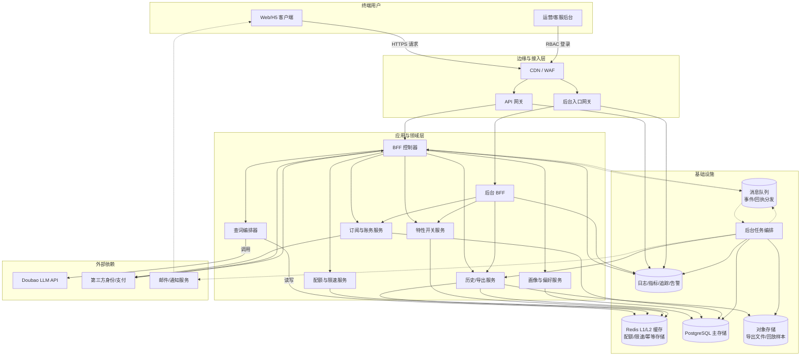
```mermaid
flowchart TB
    subgraph User[终端用户]
        Client[Web/H5 客户端]
        Admin[运营/客服后台]
    end

    subgraph Edge[边缘与接入层]
        CDN[CDN / WAF]
        APIGW[API 网关]
        AdminGW[后台入口网关]
    end

    subgraph App[应用与领域层]
        BFF[BFF 控制器]
        AdminBFF[后台 BFF]
        Orchestrator[查词编排器]
        ProfileSvc[画像与偏好服务]
        HistorySvc[历史/导出服务]
        QuotaSvc[配额与限速服务]
        FeatureFlag[特性开关服务]
        Billing[订阅与账务服务]
    end

    subgraph Infra[基础设施]
        Redis[(Redis L1/L2 缓存\n配额/限速/幂等存储)]
        RDBMS[(PostgreSQL 主存储)]
        ObjectStore[(对象存储\n导出文件/回放样本)]
        Observability[(日志/指标/追踪/告警)]
        Tasker[后台任务编排]
        Queue[(消息队列\n事件/回执分发)]
    end

    subgraph External[外部依赖]
        LLM[Doubao LLM API]
        IdP[第三方身份/支付]
        Mailer[邮件/通知服务]
    end

    Client -->|HTTPS 请求| CDN --> APIGW --> BFF
    Admin -->|RBAC 登录| CDN --> AdminGW --> AdminBFF
    BFF --> Orchestrator
    BFF --> ProfileSvc
    BFF --> HistorySvc
    BFF --> QuotaSvc
    BFF --> FeatureFlag
    BFF --> Billing
    AdminBFF --> HistorySvc
    AdminBFF --> Billing
    AdminBFF --> FeatureFlag
    Orchestrator -->|读写| Redis
    Orchestrator -->|调用| LLM
    HistorySvc --> Redis
    HistorySvc --> RDBMS
    HistorySvc --> ObjectStore
    ProfileSvc --> RDBMS
    QuotaSvc --> Redis
    FeatureFlag --> Redis
    Billing --> RDBMS
    Billing --> IdP
    BFF --> Observability
    AdminBFF --> Observability
    APIGW --> Observability
    AdminGW --> Observability
    Tasker --> HistorySvc
    Tasker --> ObjectStore
    Tasker --> RDBMS
    Tasker -.-> Queue
    Tasker --> Observability
    Queue -.-> Tasker
    BFF -.-> Queue
    Queue -.-> BFF
    BFF --> IdP
    IdP --> BFF
    Tasker -.-> Mailer
    Mailer -.-> Client
```

---

## C.2 时序图 — 功能需求对齐

> 以下每幅时序图均与《第 5 章 功能性需求（FR）》的单条需求一一对应，突出关键交互、校验点与降级路径。

### C.2.1 FR-001 语言对白名单与同语模式

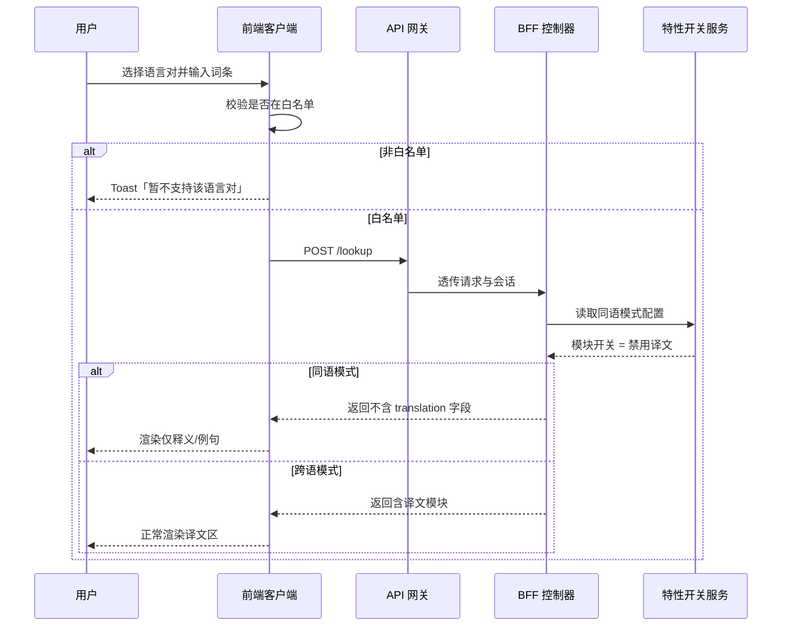
```mermaid
sequenceDiagram
    participant U as 用户
    participant C as 前端客户端
    participant G as API 网关
    participant B as BFF 控制器
    participant F as 特性开关服务

    U->>C: 选择语言对并输入词条
    C->>C: 校验是否在白名单
    alt 非白名单
        C-->>U: Toast「暂不支持该语言对」
    else 白名单
        C->>G: POST /lookup
        G->>B: 透传请求与会话
        B->>F: 读取同语模式配置
        F-->>B: 模块开关 = 禁用译文
        alt 同语模式
            B-->>C: 返回不含 translation 字段
            C-->>U: 渲染仅释义/例句
        else 跨语模式
            B-->>C: 返回含译文模块
            C-->>U: 正常渲染译文区
        end
    end
```

### C.2.2 FR-002 输入类型与句子拦截

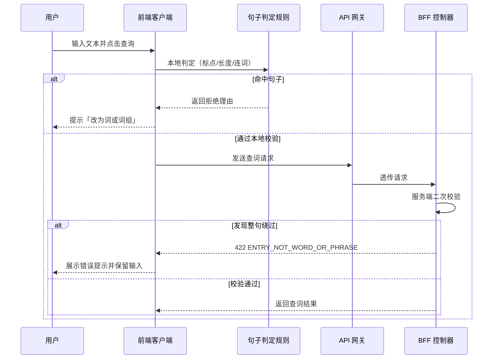
```mermaid
sequenceDiagram
    participant U as 用户
    participant C as 前端客户端
    participant Rules as 句子判定规则
    participant G as API 网关
    participant B as BFF 控制器

    U->>C: 输入文本并点击查询
    C->>Rules: 本地判定（标点/长度/连词）
    alt 命中句子
        Rules-->>C: 返回拒绝理由
        C-->>U: 提示「改为词或词组」
    else 通过本地校验
        C->>G: 发送查词请求
        G->>B: 透传请求
        B->>B: 服务端二次校验
        alt 发现整句绕过
            B-->>C: 422 ENTRY_NOT_WORD_OR_PHRASE
            C-->>U: 展示错误提示并保留输入
        else 校验通过
            B-->>C: 返回查词结果
        end
    end
```

### C.2.3 FR-003 语言识别与不确定性确认

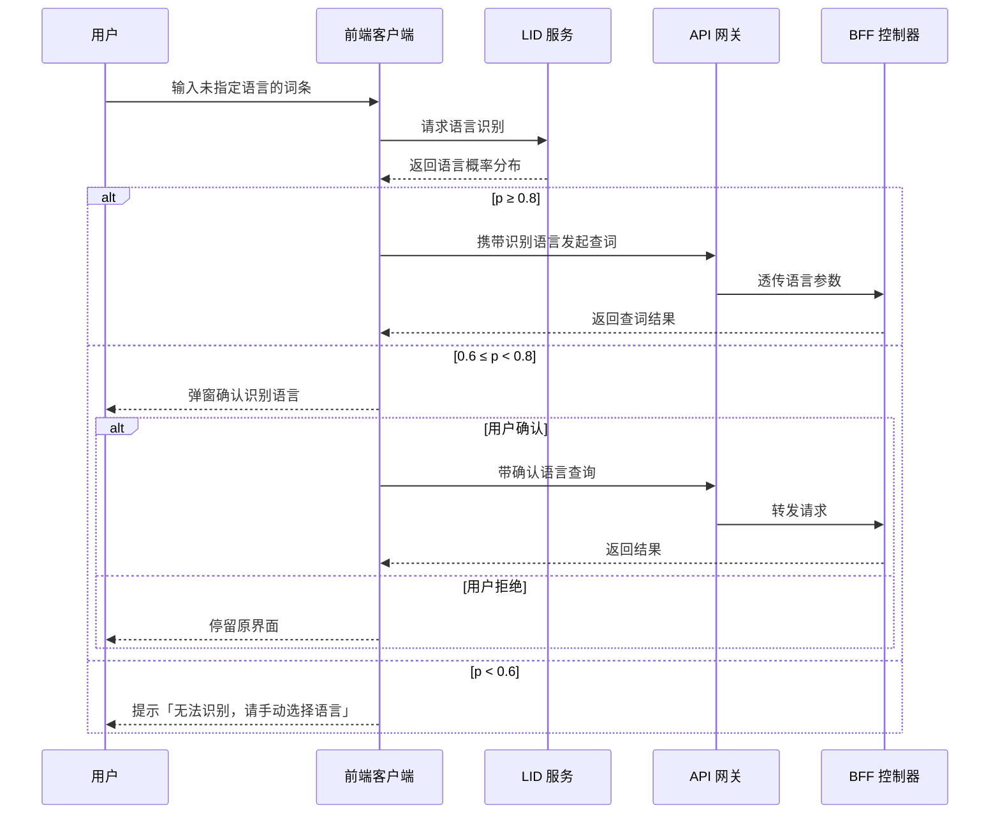
```mermaid
sequenceDiagram
    participant U as 用户
    participant C as 前端客户端
    participant LID as LID 服务
    participant G as API 网关
    participant B as BFF 控制器

    U->>C: 输入未指定语言的词条
    C->>LID: 请求语言识别
    LID-->>C: 返回语言概率分布
    alt p ≥ 0.8
        C->>G: 携带识别语言发起查词
        G->>B: 透传语言参数
        B-->>C: 返回查词结果
    else 0.6 ≤ p < 0.8
        C-->>U: 弹窗确认识别语言
        alt 用户确认
            C->>G: 带确认语言查询
            G->>B: 转发请求
            B-->>C: 返回结果
        else 用户拒绝
            C-->>U: 停留原界面
        end
    else p < 0.6
        C-->>U: 提示「无法识别，请手动选择语言」
    end
```

### C.2.4 FR-004 查词幂等与重试

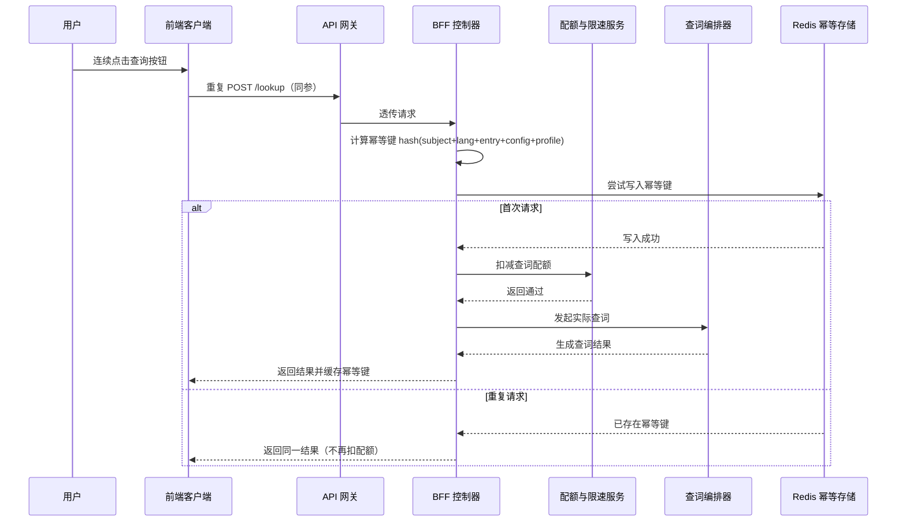
```mermaid
sequenceDiagram
    participant U as 用户
    participant C as 前端客户端
    participant G as API 网关
    participant B as BFF 控制器
    participant Q as 配额与限速服务
    participant O as 查词编排器
    participant R as Redis 幂等存储

    U->>C: 连续点击查询按钮
    C->>G: 重复 POST /lookup（同参）
    G->>B: 透传请求
    B->>B: 计算幂等键 hash(subject+lang+entry+config+profile)
    B->>R: 尝试写入幂等键
    alt 首次请求
        R-->>B: 写入成功
        B->>Q: 扣减查词配额
        Q-->>B: 返回通过
        B->>O: 发起实际查词
        O-->>B: 生成查词结果
        B-->>C: 返回结果并缓存幂等键
    else 重复请求
        R-->>B: 已存在幂等键
        B-->>C: 返回同一结果（不再扣配额）
    end
```

### C.2.5 FR-010 释义与义项

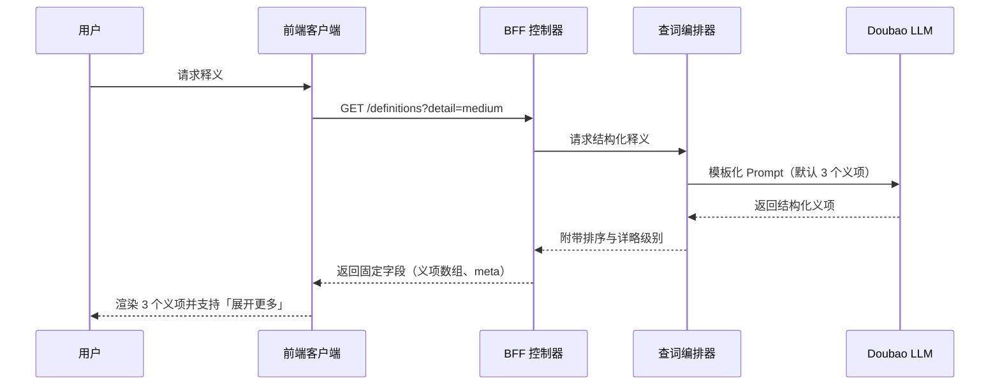
```mermaid
sequenceDiagram
    participant U as 用户
    participant C as 前端客户端
    participant B as BFF 控制器
    participant O as 查词编排器
    participant L as Doubao LLM

    U->>C: 请求释义
    C->>B: GET /definitions?detail=medium
    B->>O: 请求结构化释义
    O->>L: 模板化 Prompt（默认 3 个义项）
    L-->>O: 返回结构化义项
    O-->>B: 附带排序与详略级别
    B-->>C: 返回固定字段（义项数组、meta）
    C-->>U: 渲染 3 个义项并支持「展开更多」
```

### C.2.6 FR-011 个性化例句与控制项

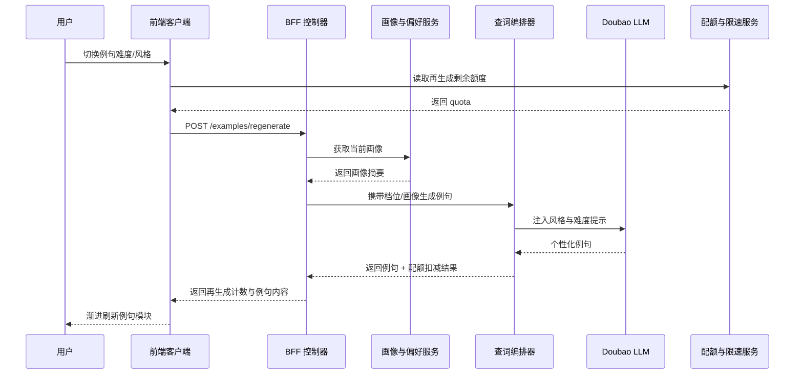
```mermaid
sequenceDiagram
    participant U as 用户
    participant C as 前端客户端
    participant B as BFF 控制器
    participant P as 画像与偏好服务
    participant O as 查词编排器
    participant L as Doubao LLM
    participant Q as 配额与限速服务

    U->>C: 切换例句难度/风格
    C->>Q: 读取再生成剩余额度
    Q-->>C: 返回 quota
    C->>B: POST /examples/regenerate
    B->>P: 获取当前画像
    P-->>B: 返回画像摘要
    B->>O: 携带档位/画像生成例句
    O->>L: 注入风格与难度提示
    L-->>O: 个性化例句
    O-->>B: 返回例句 + 配额扣减结果
    B-->>C: 返回再生成计数与例句内容
    C-->>U: 渐进刷新例句模块
```

### C.2.7 FR-012 搭配、同反义词、派生词族

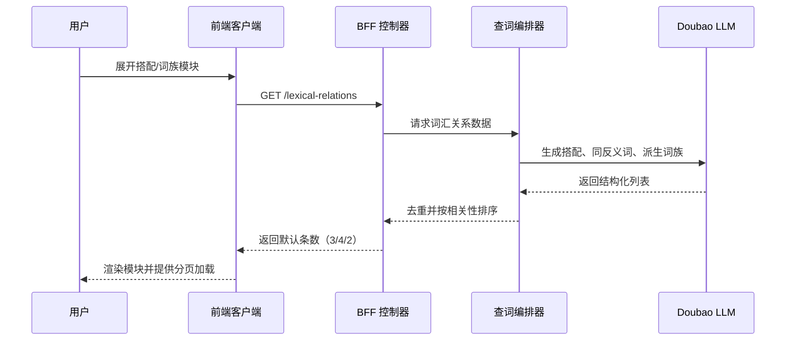
```mermaid
sequenceDiagram
    participant U as 用户
    participant C as 前端客户端
    participant B as BFF 控制器
    participant O as 查词编排器
    participant L as Doubao LLM

    U->>C: 展开搭配/词族模块
    C->>B: GET /lexical-relations
    B->>O: 请求词汇关系数据
    O->>L: 生成搭配、同反义词、派生词族
    L-->>O: 返回结构化列表
    O-->>B: 去重并按相关性排序
    B-->>C: 返回默认条数（3/4/2）
    C-->>U: 渲染模块并提供分页加载
```

### C.2.8 FR-013 模块开关、顺序与详略自定义

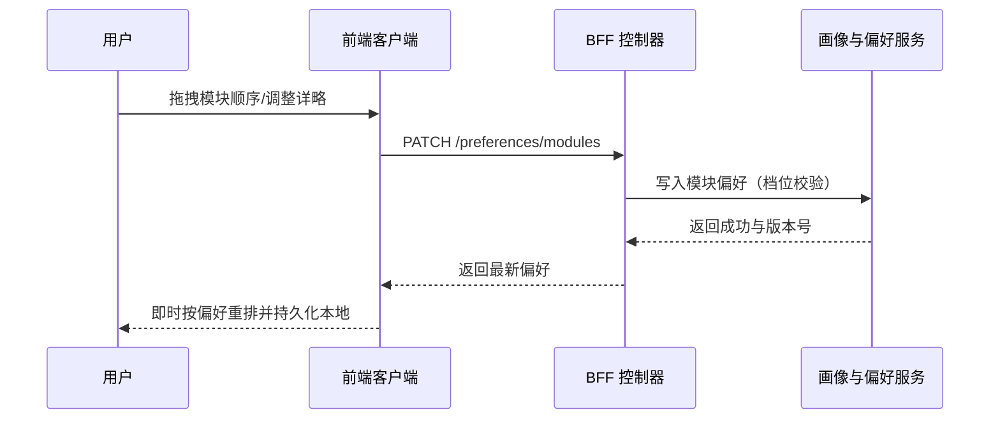
```mermaid
sequenceDiagram
    participant U as 用户
    participant C as 前端客户端
    participant B as BFF 控制器
    participant P as 画像与偏好服务

    U->>C: 拖拽模块顺序/调整详略
    C->>B: PATCH /preferences/modules
    B->>P: 写入模块偏好（档位校验）
    P-->>B: 返回成功与版本号
    B-->>C: 返回最新偏好
    C-->>U: 即时按偏好重排并持久化本地
```

### C.2.9 FR-014 频率与考试标签

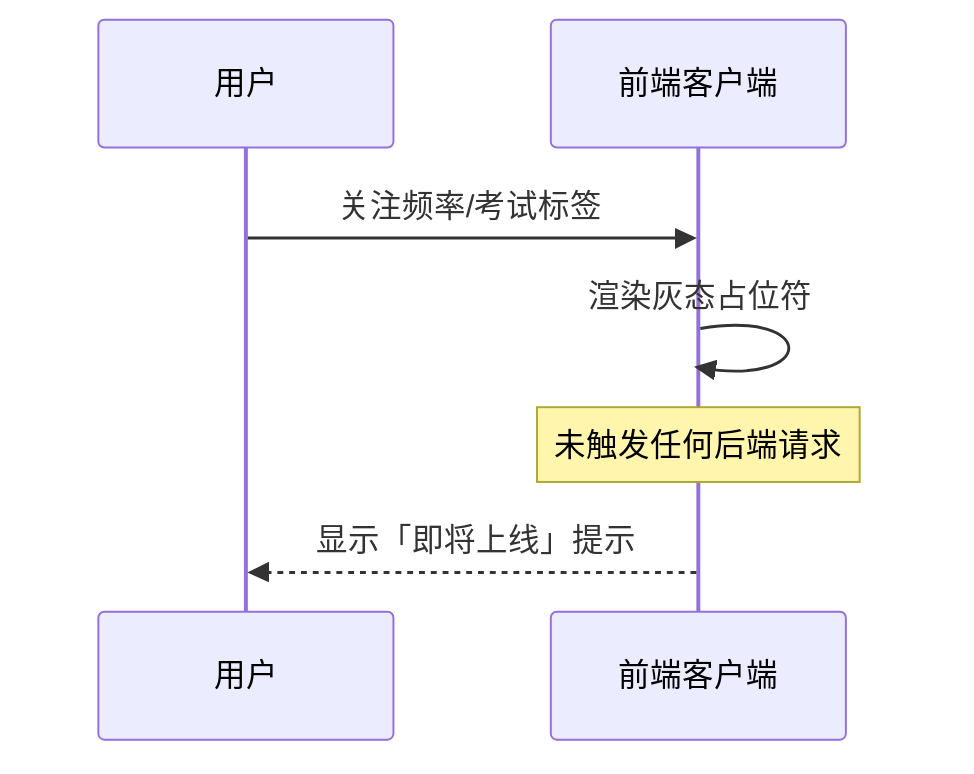
```mermaid
sequenceDiagram
    participant U as 用户
    participant C as 前端客户端

    U->>C: 关注频率/考试标签
    C->>C: 渲染灰态占位符
    note over C: 未触发任何后端请求
    C-->>U: 显示「即将上线」提示
```

### C.2.10 FR-020 历史留存与上限

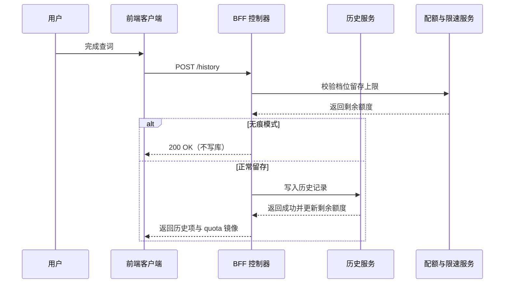
```mermaid
sequenceDiagram
    participant U as 用户
    participant C as 前端客户端
    participant B as BFF 控制器
    participant H as 历史服务
    participant Q as 配额与限速服务

    U->>C: 完成查词
    C->>B: POST /history
    B->>Q: 校验档位留存上限
    Q-->>B: 返回剩余额度
    alt 无痕模式
        B-->>C: 200 OK（不写库）
    else 正常留存
        B->>H: 写入历史记录
        H-->>B: 返回成功并更新剩余额度
        B-->>C: 返回历史项与 quota 镜像
    end
```

### C.2.11 FR-021 历史清理与分组

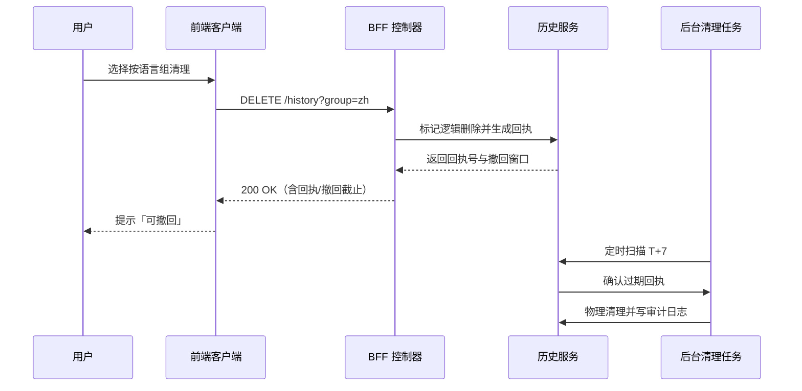
```mermaid
sequenceDiagram
    participant U as 用户
    participant C as 前端客户端
    participant B as BFF 控制器
    participant H as 历史服务
    participant Task as 后台清理任务

    U->>C: 选择按语言组清理
    C->>B: DELETE /history?group=zh
    B->>H: 标记逻辑删除并生成回执
    H-->>B: 返回回执号与撤回窗口
    B-->>C: 200 OK（含回执/撤回截止）
    C-->>U: 提示「可撤回」
    Task->>H: 定时扫描 T+7
    H->>Task: 确认过期回执
    Task->>H: 物理清理并写审计日志
```

### C.2.12 FR-022 数据导出

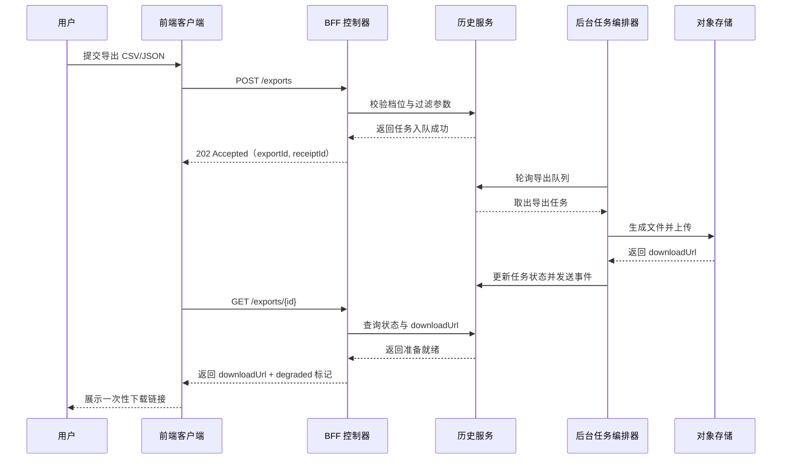
```mermaid
sequenceDiagram
    participant U as 用户
    participant C as 前端客户端
    participant B as BFF 控制器
    participant H as 历史服务
    participant T as 后台任务编排器
    participant O as 对象存储

    U->>C: 提交导出 CSV/JSON
    C->>B: POST /exports
    B->>H: 校验档位与过滤参数
    H-->>B: 返回任务入队成功
    B-->>C: 202 Accepted（exportId, receiptId）
    T->>H: 轮询导出队列
    H-->>T: 取出导出任务
    T->>O: 生成文件并上传
    O-->>T: 返回 downloadUrl
    T->>H: 更新任务状态并发送事件
    C->>B: GET /exports/{id}
    B->>H: 查询状态与 downloadUrl
    H-->>B: 返回准备就绪
    B-->>C: 返回 downloadUrl + degraded 标记
    C-->>U: 展示一次性下载链接
```

### C.2.13 FR-030 画像采集与编辑

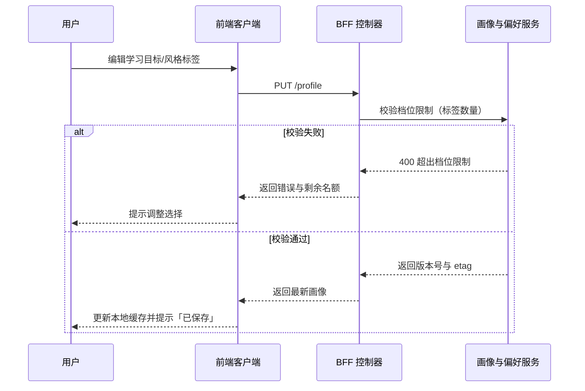
```mermaid
sequenceDiagram
    participant U as 用户
    participant C as 前端客户端
    participant B as BFF 控制器
    participant P as 画像与偏好服务

    U->>C: 编辑学习目标/风格标签
    C->>B: PUT /profile
    B->>P: 校验档位限制（标签数量）
    alt 校验失败
        P-->>B: 400 超出档位限制
        B-->>C: 返回错误与剩余名额
        C-->>U: 提示调整选择
    else 校验通过
        P-->>B: 返回版本号与 etag
        B-->>C: 返回最新画像
        C-->>U: 更新本地缓存并提示「已保存」
    end
```

### C.2.14 FR-031 画像驱动的生成控制

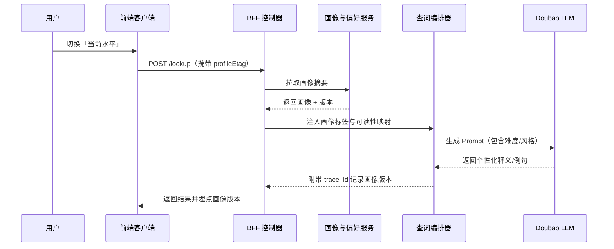
```mermaid
sequenceDiagram
    participant U as 用户
    participant C as 前端客户端
    participant B as BFF 控制器
    participant P as 画像与偏好服务
    participant O as 查词编排器
    participant L as Doubao LLM

    U->>C: 切换「当前水平」
    C->>B: POST /lookup（携带 profileEtag）
    B->>P: 拉取画像摘要
    P-->>B: 返回画像 + 版本
    B->>O: 注入画像标签与可读性映射
    O->>L: 生成 Prompt（包含难度/风格）
    L-->>O: 返回个性化释义/例句
    O-->>B: 附带 trace_id 记录画像版本
    B-->>C: 返回结果并埋点画像版本
```

### C.2.15 FR-040 账户注册与登录

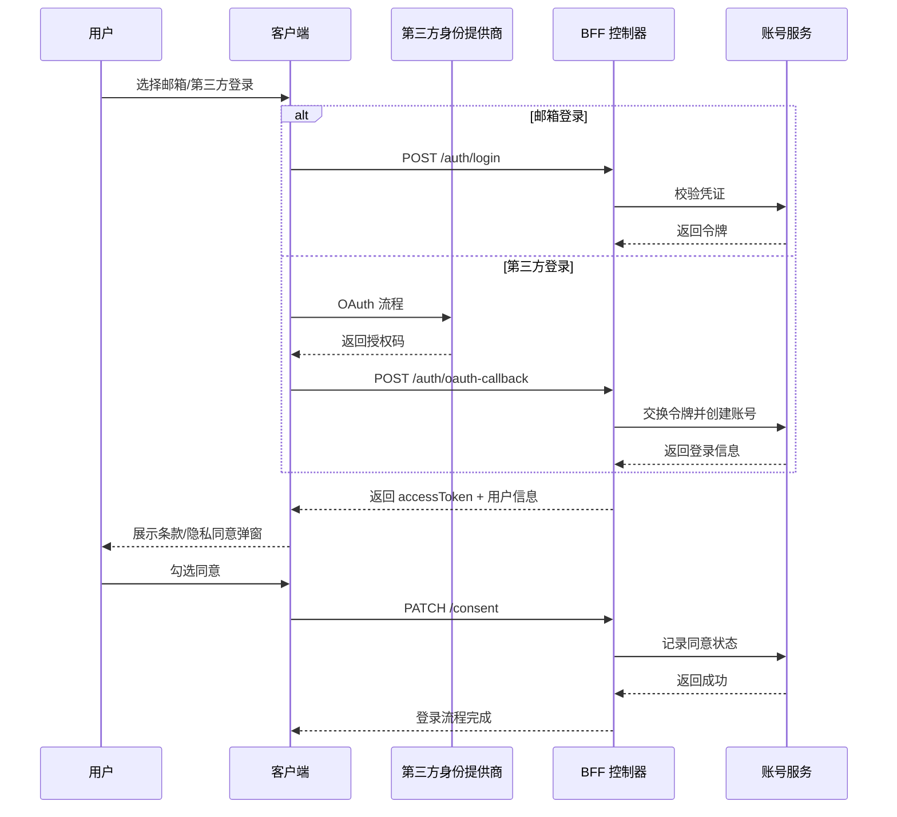
```mermaid
sequenceDiagram
    participant U as 用户
    participant C as 客户端
    participant IdP as 第三方身份提供商
    participant B as BFF 控制器
    participant Auth as 账号服务

    U->>C: 选择邮箱/第三方登录
    alt 邮箱登录
        C->>B: POST /auth/login
        B->>Auth: 校验凭证
        Auth-->>B: 返回令牌
    else 第三方登录
        C->>IdP: OAuth 流程
        IdP-->>C: 返回授权码
        C->>B: POST /auth/oauth-callback
        B->>Auth: 交换令牌并创建账号
        Auth-->>B: 返回登录信息
    end
    B-->>C: 返回 accessToken + 用户信息
    C-->>U: 展示条款/隐私同意弹窗
    U->>C: 勾选同意
    C->>B: PATCH /consent
    B->>Auth: 记录同意状态
    Auth-->>B: 返回成功
    B-->>C: 登录流程完成
```

### C.2.16 FR-041 订阅状态与能力同步

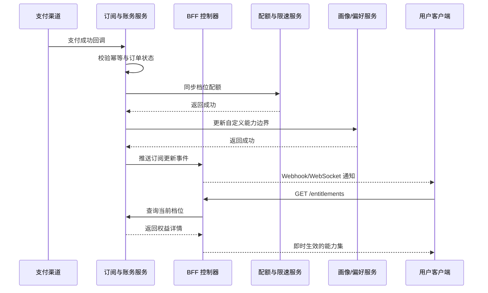
```mermaid
sequenceDiagram
    participant Pay as 支付渠道
    participant Billing as 订阅与账务服务
    participant B as BFF 控制器
    participant Q as 配额与限速服务
    participant P as 画像/偏好服务
    participant U as 用户客户端

    Pay->>Billing: 支付成功回调
    Billing->>Billing: 校验幂等与订单状态
    Billing->>Q: 同步档位配额
    Q-->>Billing: 返回成功
    Billing->>P: 更新自定义能力边界
    P-->>Billing: 返回成功
    Billing->>B: 推送订阅更新事件
    B-->>U: Webhook/WebSocket 通知
    U->>B: GET /entitlements
    B->>Billing: 查询当前档位
    Billing-->>B: 返回权益详情
    B-->>U: 即时生效的能力集
```

### C.2.17 FR-042 账单与收据展示

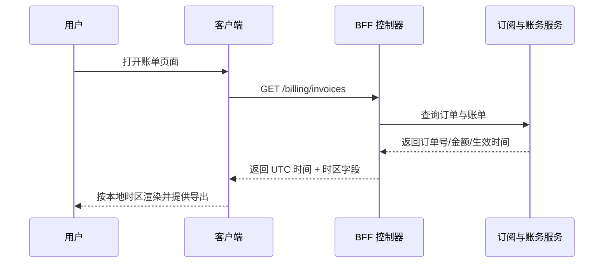
```mermaid
sequenceDiagram
    participant U as 用户
    participant C as 客户端
    participant B as BFF 控制器
    participant Billing as 订阅与账务服务

    U->>C: 打开账单页面
    C->>B: GET /billing/invoices
    B->>Billing: 查询订单与账单
    Billing-->>B: 返回订单号/金额/生效时间
    B-->>C: 返回 UTC 时间 + 时区字段
    C-->>U: 按本地时区渲染并提供导出
```

### C.2.18 FR-050 查词与再生成配额

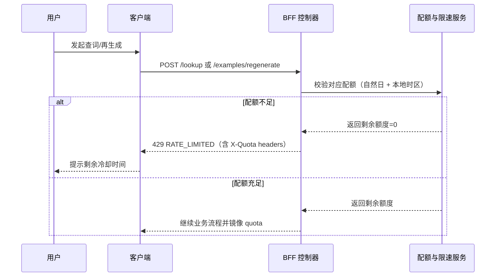
```mermaid
sequenceDiagram
    participant U as 用户
    participant C as 客户端
    participant B as BFF 控制器
    participant Q as 配额与限速服务

    U->>C: 发起查词/再生成
    C->>B: POST /lookup 或 /examples/regenerate
    B->>Q: 校验对应配额（自然日 + 本地时区）
    alt 配额不足
        Q-->>B: 返回剩余额度=0
        B-->>C: 429 RATE_LIMITED（含 X-Quota headers）
        C-->>U: 提示剩余冷却时间
    else 配额充足
        Q-->>B: 返回剩余额度
        B-->>C: 继续业务流程并镜像 quota
    end
```

### C.2.19 FR-051 限速与突发控制

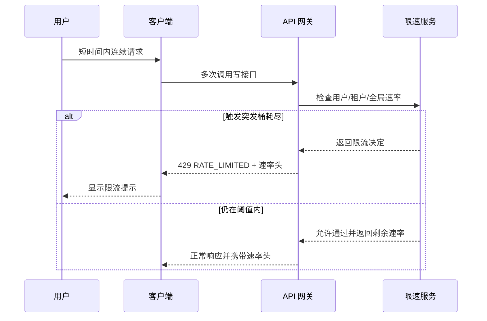
```mermaid
sequenceDiagram
    participant U as 用户
    participant C as 客户端
    participant G as API 网关
    participant Rate as 限速服务

    U->>C: 短时间内连续请求
    C->>G: 多次调用写接口
    G->>Rate: 检查用户/租户/全局速率
    alt 触发突发桶耗尽
        Rate-->>G: 返回限流决定
        G-->>C: 429 RATE_LIMITED + 速率头
        C-->>U: 显示限流提示
    else 仍在阈值内
        Rate-->>G: 允许通过并返回剩余速率
        G-->>C: 正常响应并携带速率头
    end
```

### C.2.20 FR-060 主题、快捷键与界面语言

```mermaid
sequenceDiagram
    participant U as 用户
    participant C as 客户端
    participant Local as 本地设置存储
    participant B as BFF 控制器

    U->>C: 切换主题/快捷键/界面语言
    C->>Local: 立即更新设置
    C->>B: PATCH /settings（同步到云端）
    B-->>C: 返回成功
    C-->>U: 无刷新更新 UI 并提示冲突/成功
```

### C.2.21 FR-070 Doubao API 适配与容错

```mermaid
sequenceDiagram
    participant B as BFF 控制器
    participant O as 查词编排器
    participant L as Doubao LLM
    participant D as 降级内容提供者
    participant Obs as 观测平台

    B->>O: 发起生成请求
    O->>L: 调用 Doubao API（含超时/重试策略）
    alt 调用失败或 5xx≥5%
        L-->>O: 错误/超时
        O->>Obs: 记录失败计数
        O->>O: 触发熔断并进入半开
        O->>D: 请求基础释义模板
        D-->>O: 返回降级内容
        O-->>B: 返回 degraded=true + degradeReason
    else 调用成功
        L-->>O: 返回结构化内容
        O->>Obs: 记录成功指标
        O-->>B: 正常结果
    end
```

### C.2.22 FR-071 L1/L2 缓存

```mermaid
sequenceDiagram
    participant U as 用户
    participant B as BFF 控制器
    participant O as 查词编排器
    participant L1 as Redis L1（用户级）
    participant L2 as Redis L2（共享级）
    participant L as Doubao LLM

    U->>B: 查词请求（含 userId+entry+config）
    B->>O: 发起查词
    O->>L1: 查询用户级缓存
    alt L1 命中
        L1-->>O: 返回个性化结果
        O-->>B: 标记 source=L1
    else L1 未命中
        O->>L2: 查询共享级缓存
        alt L2 命中
            L2-->>O: 返回共享结果
            O-->>B: 标记 source=L2
        else 全量未命中
            O->>L: 调用 Doubao LLM
            L-->>O: 返回新结果
            O->>L2: 写入共享缓存（TTL 30m）
            O->>L1: 写入用户缓存（TTL 10m）
            O-->>B: 标记 source=live
        end
    end
```

### C.2.23 FR-080 逻辑删除与物理清理

```mermaid
sequenceDiagram
    participant U as 用户
    participant C as 客户端
    participant B as BFF 控制器
    participant H as 历史服务
    participant Task as 清理任务

    U->>C: 删除单条历史
    C->>B: DELETE /history/{id}
    B->>H: 标记逻辑删除并记录回执
    H-->>B: 返回回执与恢复截止时间
    B-->>C: 返回成功
    C-->>U: 隐藏该记录并提示可恢复
    Task->>H: 定时扫描到期回执
    H->>Task: 返回需清理列表
    Task->>H: 执行物理删除
```

### C.2.24 FR-081 条款与隐私管理

```mermaid
sequenceDiagram
    participant U as 用户
    participant C as 客户端
    participant B as BFF 控制器
    participant Auth as 账号服务

    U->>C: 首次登录后查看弹窗
    C-->>U: 展示条款与隐私链接
    alt 用户同意
        U->>C: 勾选并提交
        C->>B: PATCH /consent
        B->>Auth: 记录同意状态
        Auth-->>B: 返回成功
        B-->>C: 允许继续使用
    else 用户撤回
        U->>C: 在设置页点击撤回
        C->>B: POST /consent/revoke
        B->>Auth: 更新状态并触发数据处理指引
        Auth-->>B: 返回成功
        B-->>C: 返回限制能力
        C-->>U: 提示仅可离线浏览/退出
    end
```

### C.2.25 FR-090 订阅开通与续费

```mermaid
sequenceDiagram
    participant U as 用户
    participant C as 客户端
    participant Pay as 支付渠道
    participant Billing as 订阅服务
    participant B as BFF 控制器

    U->>C: 选择订阅方案并支付
    C->>Pay: 创建支付订单
    Pay-->>C: 返回支付页面
    U->>Pay: 完成支付
    Pay->>Billing: 通知支付成功
    Billing->>Billing: 幂等处理订单状态
    Billing->>B: 推送订阅已生效事件
    B-->>C: WebSocket/Push 更新能力
    C-->>U: 显示成功提示并刷新权益
```

### C.2.26 FR-091 到期与降级处理

```mermaid
sequenceDiagram
    participant Billing as 订阅服务
    participant Scheduler as 定时任务
    participant B as BFF 控制器
    participant Q as 配额与限速服务
    participant P as 偏好服务
    participant U as 用户客户端

    Scheduler->>Billing: 轮询即将到期订阅
    Billing->>Billing: 判断到期
    Billing->>Q: 下发降级配额
    Q-->>Billing: 返回成功
    Billing->>P: 回退超出能力的自定义项
    P-->>Billing: 完成降级写入
    Billing->>B: 发布降级事件
    B-->>U: 通知「订阅已到期」
    U->>B: GET /entitlements
    B->>Billing: 查询最新档位
    Billing-->>B: 返回降级后能力
    B-->>U: 展示更新后的限制
```

### C.2.27 FR-092 退款与异常对账

```mermaid
sequenceDiagram
    participant Pay as 支付渠道
    participant Billing as 订阅服务
    participant Recon as 对账任务
    participant B as BFF 控制器
    participant U as 用户客户端

    Pay->>Billing: 推送退款完成
    Billing->>Billing: 幂等更新订单状态
    Billing->>B: 通知档位回退
    B-->>U: 推送退款结果
    Recon->>Billing: 定时对账
    Billing-->>Recon: 返回差异清单
    Recon->>Billing: 触发补偿更新
    Billing->>B: 再次校准权限/账单
    U->>B: GET /billing/invoices
    B->>Billing: 返回历史记录（含退款痕迹）
    Billing-->>B: 提供可追溯账单
```

### C.2.28 FR-100 首屏渐进渲染

```mermaid
sequenceDiagram
    participant U as 用户
    participant C as 客户端
    participant B as BFF 控制器
    participant O as 查词编排器

    U->>C: 打开查词结果页
    C->>B: 请求各模块数据
    B->>O: 并行请求释义/例句/搭配
    O-->>B: 优先返回释义模块
    B-->>C: 先流式推送释义
    C-->>U: 渲染首块内容 (P95 ≤ 2.5s)
    O-->>B: 陆续返回例句/搭配
    B-->>C: 分块返回
    alt 某模块失败
        B-->>C: 返回错误与重试入口
        C-->>U: 显示局部失败提示
    else 正常
        C-->>U: 渐进完成渲染
    end
```

---

## C.3 状态机 — 导出任务生命周期

```mermaid
stateDiagram-v2
    [*] --> Draft: 用户提交导出请求
    Draft --> Draft: 用户更新过滤条件/格式
    Draft --> Queued: 参数校验通过\n写入导出任务表
    Draft --> Failed: 参数非法/配额不足
    Draft --> Cancelled: 用户主动撤回

    Queued --> Queued: 任务排队等待\n可见于任务列表
    Queued --> Generating: 后台任务编排器拉取
    Queued --> Cancelled: 用户撤回且尚未开工

    Generating --> Generating: 临时失败重试\n<= 3 次（指数退避）
    Generating --> Completed: 导出文件生成\n写入对象存储
    Generating --> Failed: 重试超限或存储异常

    Completed --> Delivered: 生成一次性下载链接\n写入对象存储元数据
    Completed --> Failed: 写回通知或回执失败

    Delivered --> Expired: TTL 10 分钟到期
    Delivered --> Deleted: 用户主动删除
    Expired --> Deleted: 定时清理
    Failed --> Deleted: T+7 天物理清理
    Cancelled --> Deleted: 清理残留元数据
```

---

## C.4 使用说明

- **配色与图例**：Mermaid 使用默认主题，方框表示内部组件，圆角表示外部依赖或状态；虚线箭头代表事件/通知，实线箭头代表同步调用。
- **与主体章节的对应**：
  - 系统上下文图对应《第 7 章》中的层次划分，补充后台入口、账务与通知等依赖的边界。
  - 时序图逐条映射《第 5 章》 FR-001–FR-100 的功能路径，方便研发与测试按照需求定位接口、校验点与降级策略。
  - 状态机图映射《第 7.4.3 节》导出任务的状态控制与清理策略，补充撤回、失败回滚与通知失败路径。
- **扩展与演进**：若后续引入多租户或更多客户端形态，可在上下文图中扩展租户隔离边界，并为关键时序补充并行泳道与事件流。
