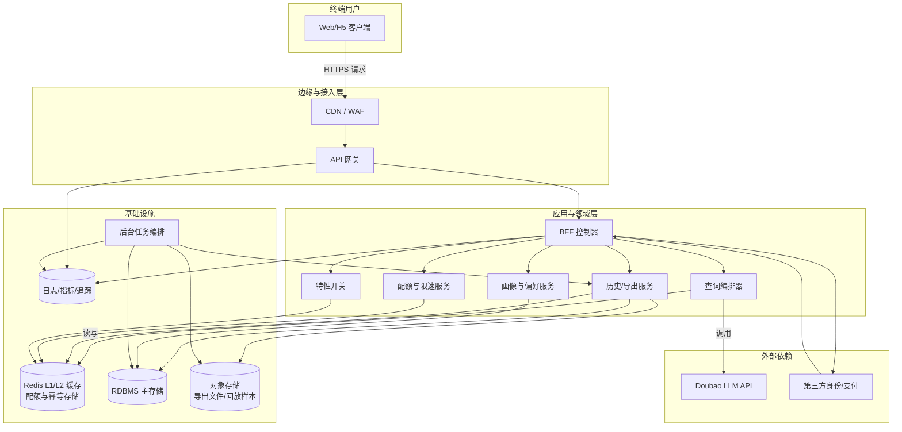
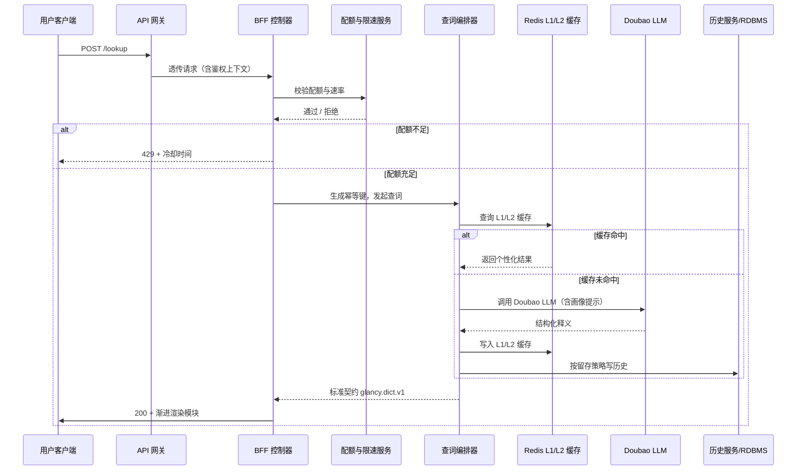
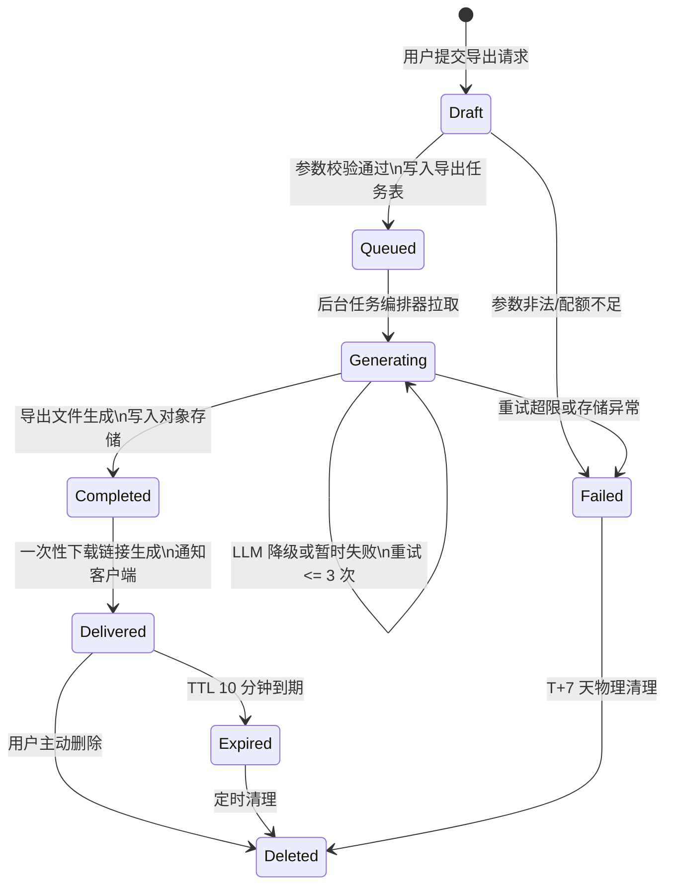

# 附录 C 图示（系统上下文、时序、状态机）

> 本附录采用 Mermaid 图示补充主体章节的叙述，帮助快速理解 Glancy 词汇助手的核心交互、边界与状态流转。除非另有说明，图中组件命名与《第 7 章 系统架构与组件》保持一致。

---

## C.1 系统上下文图

---

## C.2 时序图 — 查词与个性化生成

---

## C.3 状态机 — 导出任务生命周期

---

## C.4 使用说明

- **配色与图例**：Mermaid 使用默认主题，方框表示内部组件，圆角表示外部依赖或状态。必要时通过注释说明边界。 
- **与主体章节的对应**：
  - 系统上下文图对应《第 7 章》中的层次划分，补充各层交互方向。
  - 时序图重现《第 7.4.1 节》查词流程，突出缓存命中与降级分支。
  - 状态机图映射《第 7.4.3 节》导出任务的状态控制与清理策略。
- **扩展与演进**：若后续引入多租户或更多客户端形态，可在上下文图中扩展外部方框，并为关键时序补充并行泳道。
