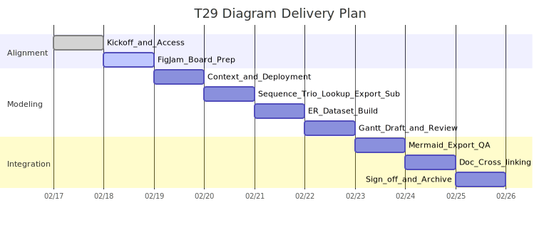

# 第 21 章 发布计划与灰度策略

> 目的：在满足“零停机、可回滚、可观测、可审计”的前提下，明确 Glancy 的发布列车、环境门禁、灰度放量、回滚触发与演练机制，确保端到端体验与成本在阈值内，并与契约、配额/限流、数据治理、订阅权益等单一事实源对齐。章节定位与目录一致，属[第 21 章](https://chatgpt.com/g/g-p-690ce154ad1c8191b5ea360736e3600e-glancy/c/第 21 章 发布计划与灰度策略.md)条目。 

------

## 21.1 适用范围与上位约束

- 本章约束对象：Web/H5 客户端、API 网关、BFF/应用层、适配与集成层（含 Doubao 适配器）、数据与缓存层、任务编排与可观测性。与“零停机发布、灰度/回滚、契约回放≥500 样本”的非功能性门槛一致。 
- 部署环境与形态沿用“Dev/Staging/Prod 隔离；Prod 采用蓝绿/小流量灰度与自动回滚”的架构与部署基线。 
- 发布目标需持续满足端到端 P95 ≤ 2.5 s、均值 ≤ 1.2 s 的体验门槛与关键接口 SLO。  

------

## 21.2 环境分层与发布列车

### 21.2.1 环境与通道

- **Dev**：功能联调与契约样本累计；允许频繁合并。
- **Staging**：准生产验证；开启合规/告警/审计全量；对接真实外部依赖的沙箱。
- **Prod**：蓝绿+灰度；全链路指标纳入错误预算；自动回滚启用。
   环境隔离与部署策略与第 7 章一致。 

### 21.2.2 发布节奏（建议）

- **周发布列车**：每周固定窗口 1 次主发布，必要时追加补丁车次（hotfix）。
- **冻结与解冻**：发布前 24 小时冻结业务配置变更（除特性开关外），发布后 2 小时观测解冻。

> 发布节奏与窗口可按运营活动动态调整，但必须满足后述“门禁清单”与“灰度守门人”要求。

> **发布甘特（T29）**：FigJam [node 230-140](https://www.figma.com/file/glancy-sdd-figjam?type=whiteboard&node-id=230-140#T29Gantt) / Mermaid 源 [`doc/图/src/gantt-t29.mmd`](../图/src/gantt-t29.mmd) / 快照 [`doc/图/export/gantt-t29.svg`](../图/export/gantt-t29.svg)。



------

## 21.3 发布门禁（Pre‑flight Gate）

进入 Staging→Prod 的必要条件如下，均需在 CI/CD 与变更评审单中留痕：

| 类别      | 门禁项         | 阈值/要求                                            | 依据                                   |
| --------- | -------------- | ---------------------------------------------------- | -------------------------------------- |
| 契约      | 契约回放样本   | ≥500 条，通过率 100%                                 | NFR‑009、7.10、9.8/9.12 契约与回放口径 |
| 性能      | 端到端首屏     | P95 ≤ 2.5 s、均值 ≤ 1.2 s（Staging 压测与小流量）    | 1.6 指标、6.3 预算、6.3.2 SLO          |
| 可用性    | 关键接口成功率 | /lookup ≥99.9%、/regenerate ≥99.5%（小流量）         | 6.3.2 SLO                              |
| 降级      | 熔断与回退演练 | 触发 Doubao 5xx≥5% 持续 1 分钟时自动降级             | NFR‑003/017、7.4.5                     |
| 成本      | 成本燃率       | 近 5 分钟成本/日预算 ≤ 1.2×                          | 10.10 成本告警阈值                     |
| 配额/限速 | 429 命中率     | 全局 ≤ 3%（5 分钟均值）                              | 10.10 指标表                           |
| 兼容      | 浏览器与设备   | 覆盖既定支持矩阵且降级不失能                         | NFR‑010/033（与第 18 章对齐）          |
| 安全/隐私 | TLS/脱敏/无痕  | 传输与存储加密、无痕不落库原文、下载链接 TTL=10 分钟 | NFR‑020/022/023、1.4 口径              |

------

## 21.4 放量策略（灰度分层）

### 21.4.1 维度与分桶

灰度按多维组合切流，默认优先级：**档位 Plan（Pro/Plus/Free） > 语言对（L1–L4） > 匿名/登录 > 端形态（Web/H5）**。支持按用户画像与角色做补充筛选（RBAC 与 Persona 不改变功能边界）。  

### 21.4.2 标准放量阶梯（建议默认）

1. **Step 0（蓝绿健康检查）**：非业务流量 + 内部白名单 0.5% 请求，5–10 分钟。
2. **Step 1（1% Canary）**：Pro 用户、L3/L2 语言对，监控 P95、429、错误率与成本燃率。
3. **Step 2（5%）**：扩至 Plus 用户与 L1/L4；确认订阅开通与权益同步 ≤ 5 s。
4. **Step 3（15%）**：覆盖 Free 用户，打开再生成路径与导出路径，验证配额/限速回传头。
5. **Step 4（50%）**：全量前最后观察窗（≥30 分钟）。
6. **Step 5（100% 切换）**：翻转流量权重；保留旧版本 30–60 分钟可快速回退。

每一阶的放量条件与拦截阈值遵循 21.5 的“守门人阈值”。特性开关与紧急 kill switch 由配置中心统一下发。

> **Release Batch 代号（供 20.21、22 章引用）**：`REL-B0=Step0`、`REL-B1=Step1`、`REL-B2=Step2`、`REL-B3=Step3`、`REL-B4=Step4`、`REL-B5=Step5`。

### 21.4.3 灰度准入清单

| 编号  | 灰度准入项           | 通过条件                                                     | 回滚/开关说明                                                   |
| ----- | -------------------- | ------------------------------------------------------------ | ---------------------------------------------------------------- |
| GR‑01 | 契约回放门槛         | 契约回放样本 ≥500 且通过率 100%，CI/CD 与变更单中留痕       | 灰度失败自动回滚一阶；Kill switch 维持零停机切换，参考第 13 章  |
| GR‑02 | 自动回滚与 kill switch | 自动回滚脚本可用；Kill switch 已在配置中心预置并演练通过     | 任一回滚条件触发即自动翻转；手动开关零停机关闭新版本流量       |

> 契约与回滚准入条件与第 13 章验收清单保持口径一致，确保灰度阶段具备“契约回放≥500 样本通过、失败自动回滚、零停机”的守门标准。

### 21.4.4 灰度批次执行追踪表（REL-Bx）

| 批次 | 流量与切分维度                                           | 守门指标（引用章节/Hook）                                                                                                                                                 | 观察与记录                               | 自动动作 / 回滚入口                              |
| ---- | -------------------------------------------------------- | ------------------------------------------------------------------------------------------------------------------------------------------------------------------------- | ---------------------------------------- | ----------------------------------------------- |
| REL-B0（Step0） | 内部白名单 0.5%，蓝绿切换、K6/合成流量             | 合成 `/lookup` P95 ≤2.5 s、契约回放全绿（22.8）、HK‑01/HK‑02 未触发、DR-01/DR-05 演练打勾                                                                               | CI/CD 日志 + 发布工单 `pre-flight`       | 未达标则停留在 Staging，禁止向生产放量          |
| REL-B1（Step1） | 1% Canary（Pro、L2/L3）                          | /lookup P95 ≤2.5 s、429≤1%、成本燃率≤0.8（HK‑03）、订阅开通过程成功率≥99%（11.12）、HK‑05=0                                                                               | 观测看板 + `release_batches` 表记录      | 任意红灯→翻回蓝绿旧版本；记录 incident ID       |
| REL-B2（Step2） | 5%（Plus，扩 L1/L4）                             | 增量语言对成功率≥99.5%；再生成配额正确（AC‑UC02）；限流命中≤2%（HK‑04）；导出/历史指标无回退                                                                             | 加注 `trace_id` 批次标签                 | 超阈值即回滚一阶；自动对比配额/账单镜像          |
| REL-B3（Step3） | 15%（含 Free，开放历史/导出）                    | Free 用户 P95 ≤2.8 s；导出回执≤5 s（AC‑UC06）；逻辑删延迟≤5 s；DR-04、DR-02 spot-check；HK‑03 未进 Red                                                                   | 发布仪表盘 + DR 复检记录                 | 触发红灯→切回 REL-B2 并暂停 Free 流量            |
| REL-B4（Step4） | 50%（放量前观察窗 ≥30 分钟）                     | 错误预算消耗≤20%；降级率≤1%（HK‑06）；成本燃率≤1.2×；日志/告警抑制策略生效；Release Notes 校对完成（22.12.3）                                                           | `release_batches` 工单 + 21.10 看板截图 | 任何指标破线→回滚至 Step3 并重新观察            |
| REL-B5（Step5） | 100% 翻转（旧版本保留 30–60 分钟可快速回退）     | 24 h 内关键 SLO 稳定，HK‑01/02/03/04/05/06 全绿；棕断/公告准备（22.5）；复盘条目齐备                                                                                      | 发布复盘模板 + 审计日志                   | 自动回滚脚本在 30 分钟内可复原；如失败启动 DR-05 |

> `release_batches` 表是发布工单与 20.21 追踪矩阵的镜像字段，观测截图、告警记录、回滚动作均与批次号关联，便于复盘与审计。

------

## 21.5 守门人与回滚阈值

### 21.5.1 放量“绿灯”条件（全需满足）

- /lookup P95 ≤ 2.5 s，错误率≤0.1%；/regenerate P95 ≤ 3.0 s。 
- 429 命中率 ≤ 3%；成本燃率 ≤ 1.2× 日预算；L1/L2 命中率不低于基线（L1≥40%、L2≥20%）。  
- 熔断未打开或半开探测通过；降级比例 ≤ 1%（非演练期间）。 

### 21.5.2 自动回滚“红灯”条件（任一触发即回滚一阶）

- 5 分钟窗口内任一关键接口 SLI 跌破 SLO（/lookup <99.9%、/regenerate <99.5%）。 
- 成本燃率 > 1.5×；或全局保护阈值触发且无法在 5 分钟内恢复。 
- Doubao 5xx≥5% 持续 1 分钟导致熔断开启。 
- 错误码集中于契约解析失败（`CONTRACT_VALIDATION_FAILED`）或上游不可用（`UPSTREAM_UNAVAILABLE`）异常突增。 

### 21.5.3 人工“黄灯”观察与动作

- 429 升高但 SLO 未破：临时调低突发桶并开启“强缓存优先”（L2 优先、TTL×2）。 
- 成本接近 95% 阈值：关闭再生成，查词走“L2→L1→简化回退”链路。 

------

## 21.6 回滚与灾备预案

- **优先级**：灰度回退一阶 → 蓝绿翻转至旧版本 → 触发“基础释义+模板例句”降级路径。  
- **契约与数据**：维持向后兼容；若出现契约破坏性变更风险，立即关闭新版本流量并按 22 章走弃用期流程。 
- **订阅域保护**：支付回调与权益同步异常时，启用“回调优先、轮询兜底、幂等更新”，确保 ≤ 5 s 权益一致性优先级高于回滚。 

### 21.6.1 回滚 Runbook（可复演）

1. **检测与判定**：HK‑01～HK‑06 任一触发红灯（21.5.2）→ 发布管理员确认批次号（REL-Bx）并锁定当前灰度比例。  
2. **冻结与公告准备**：立刻冻结后续放量与配置变更，触发 `release_batches` 工单中的“Rollback Draft”；客服准备公告模板（21.17.2）。  
3. **自动动作**：执行 `rollback_stage.sh --batch REL-Bx`（蓝绿切回旧版本）→ 触发 Kill Switch/特性开关 → 启动 DR-05/DR-01 对应脚本，确保退化链路已开启。  
4. **验证与记录**：利用 20.21 追踪矩阵中该批次关联的 AC/TC 进行快速回归（例如 UC‑01/TC-PERF-001、UC‑14/DR-01）；将观测截图与告警 ID 附在工单中。  
5. **沟通与追溯**：15 分钟内完成公告分发（21.17），并把根因/影响/恢复时间写入 incident 与发布复盘；若影响契约或 Sunset 时间线，立即同步到 22.16 日历。  
6. **解除与复盘**：确认旧版本稳定 ≥30 分钟方可重启灰度；复盘表需列出触发 Hook、批次、所用回滚脚本与下一步防范措施。

------

## 21.7 特性开关与配置管理

- **范围**：模块开关/顺序/详略灰度、配额与限速参数、成本护栏、紧急 kill switch。
- **变更原则**：特性开关可在冻结窗口内下发；配置变更需审计与回滚点。
- **灰度支持**：按用户、档位、语言对与端形态切流。参见第 7 章“特性开关与配置中心”。 

------

## 21.8 架构与数据变更发布

- **数据库迁移**：大表变更采用“影子列/默认空+异步回填+双写/读兼容”策略，分批上线；严格遵循 9.12 的迁移与双写方案。 
- **缓存与一致性**：画像/订阅/模块开关变更触发相关键失效；读优先模式保障最终一致。 
- **导出与删除编排**：发布不影响“下载链接一次性、TTL 10 分钟、逻辑删即时/物理清理 T+7 天”的统一语义。 

------

## 21.9 合同/契约策略与双版本演进（与第 22 章衔接）

- **运行期契约**：对外保持 `glancy.dict.v1`，不兼容升级须走新主版本并设置 Sunset 头与弃用期（详见第 22 章）。 
- **回放与门禁**：CI 保持 ≥500 条契约样本；发布前与灰度期间对差异告警。 

------

## 21.10 观测、告警与看板

- **三类信号**：指标/日志/链路，99% 请求具备 trace_id；发布窗口内错误预算实时累计。 
- **核心看板**：SLO（可用性/延迟/错误）、429 命中率、成本燃率、L1/L2 命中率、配额消耗、订阅开通/续费成功率与权益同步时延。  
- **告警策略**：阈值+速率+抑制；>3% 429、>1.2× 燃率、并发占用>90% 持续 2 分钟触发告警与自动化动作。 

------

## 21.11 端到端演练（预生产与生产演练）

- **降级演练**：人工拉高 Doubao 错误与超时，验证自动降级与 UI 退化徽标出现、回退后恢复。 
- **配额/限速演练**：压测达到租户/全局阈值，验证 429 语义与冷却提示、X‑RateLimit/X‑Quota 头与响应体镜像一致。  
- **订阅域演练**：开通/续费/升级/到期降级链路，验证 ≤5 s 权益同步与“读写穿透+更宽松不超限”策略。 

------

## 21.12 上线步骤清单（运行级）

1. **变更单审批通过**：包含风险评估、回滚方案、影响面与联动人。
2. **CI 门禁通过**：契约回放≥500、单元/集成/E2E 全绿。 
3. **蓝绿部署完成**：健康检查通过、只读探针与审计开关打开。 
4. **Step 0–5 灰度**：每阶≥10–30 分钟；看板与阈值按 21.5 执行。
5. **翻转与稳定观察**：100% 后至少观察 30–60 分钟；归档观测与审计。
6. **发布复盘**：SLO/成本/告警/工单回顾，沉淀 Playbook。

------

## 21.13 风险清单与对策

| 风险          | 表现                | 对策                                                         |
| ------------- | ------------------- | ------------------------------------------------------------ |
| 上游不可用    | Doubao 5xx/超时升高 | 自动降级到“基础释义+模板例句”，半开探测恢复；保持配额与计费语义一致。 |
| 成本失控      | tokens_out 异常高   | 触发成本护栏：强缓存、限制再生成、详略降一档。               |
| 配额/限速误配 | 429 飙升            | 即时下发参数热更新或切回干跑，回放 1 周后再启用。            |
| 契约不兼容    | 客户端报错/解析失败 | 立刻回滚一阶、恢复旧版本；按 22 章走弃用期并补回放样本。     |
| 数据迁移阻塞  | 写入慢/锁等待       | 影子列+异步回填+分批迁移；必要时只读模式短时开启。           |

------

## 21.14 角色分工与沟通

- **发布管理员（Release Manager）**：全程负责放量与回滚决策，维护 Runbook。
- **观测与告警（SRE/运维）**：看板与阈值守门人，执行自动化回滚。
- **后端负责人**：契约与数据迁移把关，处理上游适配与降级策略。
- **前端负责人**：渐进渲染与错误提示策略、兼容性验证。
- **计费与订阅域负责人**：权益同步与对账监控。
- **客服/运营**：公告与用户引导、问题回收与标签。

> 所有跨域动作需写入 `audit_events` 并在发布复盘中归档。 

------

## 21.15 与业务与测试的联动

- **与第 2 章里程碑对齐**：M1 内测必须打通“查词→渲染→再生成→历史/导出→降级链路”；M2 发布门槛为 2.2 的量化指标。 
- **与第 5/8/10/11/9 章对齐**：FR 的渲染与控制项、API 的头/体与错误语义、配额/限流回传、订阅权益同步、数据留存与删除语义，均作为发布验收的检查点。     

------

## 21.16 验收与完成标准（发布侧）

- 完成 21.3 门禁清单所有项并留存证据；
- 在 21.4–21.5 的灰度与阈值机制下达到 100% 放量；
- 发布 24 小时内，无新增 Sev‑1/Sev‑2 事故；SLO 与成本回到基线区间；
- 复盘完成并更新 Playbook/Runbook 与契约样本库（新增 ≥50 条差异样本）。 

------

## 21.17 公告与沟通模板

> 模板与 22.12.3 Release Notes 字段一致，减少重复录入。公告通过客服门户、站内信与状态页对外分发，同时在 `release_batches` 工单中归档。

### 21.17.1 标准发布公告模板

```
Title: [Release Notice] Glancy REL-B{n} Production Rollout
Batch: REL-B{n}（对应 Step n）
Window: <UTC 时间段>
Scope: 模块/接口/契约（引用 FR/UC/AC）
Guards: SLO, 成本燃率, 429, 契约回放 ≥500（链接至监控）
User Impact: 预期收益、是否需要客户端动作
Rollback Plan: 回滚脚本/开关名 + RTO
Contact: Release Manager / Oncall（含 Trace ID）
```

### 21.17.2 回滚/降级公告模板

```
Title: [Incident & Rollback] Glancy REL-B{n} Reverted
Time Detected: <UTC 时间段>
Trigger: Hook (HK-0x) / 守门指标
Impact: 受影响账户/语言对/比例、暂时降级措施
Actions Taken: 回滚批次、Kill Switch、DR 脚本
Next Steps: 预计恢复时间、客户需执行的操作（若有）、后续公告时间
Reference: Incident ID、Release Notes 链接、Sunset/Deprecation 是否受影响
```

> 所有公告须在 15 分钟内发出初稿（回滚场景），并在复盘中粘贴最终版本，供 22.16 日历与 19 章风险钩子引用。

------

### 附：发布看板指标建议（Prod）

- **延迟**：/lookup P95、/regenerate P95、端到端均值
- **成功率**：关键接口 SLI、降级比例
- **配额/限速**：429 命中率、X‑RateLimit/X‑Quota 头一致性
- **缓存**：L1/L2 命中率
- **成本**：近 5 分钟燃率、单请求成本 P95
- **订阅域**：开通/续费成功率、权益同步时延 P95
- **错误分布**：契约校验失败、上游不可用、熔断状态
   对应度量与阈值来源见 6.3/6.10/10.10/11.16。   

------

> 本章落地后，发布将成为“契约→门禁→灰度→回滚/复盘”的标准闭环，与系统架构、NFR、API/数据口径与配额/订阅域保持一致，满足 MVP 与后续演进所需的可控上线能力。     
