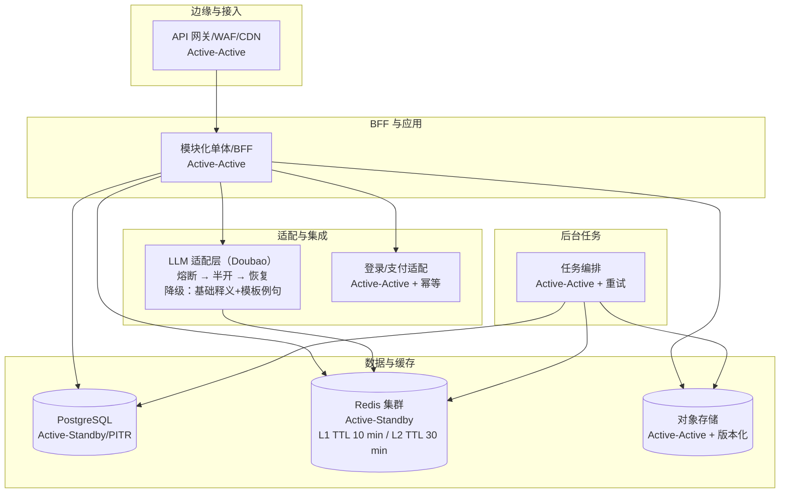

# 第 7 章 系统架构与组件

> 本章在既有 MVP 范围、性能目标、缓存与降级、留存与导出、订阅和对账等约束之上，给出可落地的系统架构与组件划分，支撑第 3–5 章用例与 FR/NFR 的实现，并为后续 7–16 章（接口、数据、限流、合规、运维等）提供结构基线。 

------

## 7.1 架构原则

- **简单优先，演进为先**：MVP 采用“模块化单体 + 独立基础设施服务”的形态，边界清晰，便于迭代为多服务。
- **契约优先**：所有对外与对内消息均遵循结构化契约 `glancy.dict.v1`，不兼容变更走弃用期策略。 
- **故障隔离与有损降级**：第三方依赖触发熔断时回退到“基础释义 + 模板例句”。 
- **缓存分层**：L1 用户级短期缓存，L2 跨用户共享缓存，TTL 分别 10 分钟与 30 分钟。 
- **配额与限速分层**：用户级、租户级、全局三级限流，独立于“查词/再生成”配额。 
- **隐私最小化与可回收**：默认最小数据采集，用户可关闭留存；逻辑删除即时，物理清理延迟 7 天。 
- **端到端性能预算**：满足 P95 ≤ 2.5 s、均值 ≤ 1.2 s 的目标。 

------

## 7.2 逻辑架构总览

自上而下划分为六层：

1. **客户端层（Web/H5）**：输入校验、模块渲染、设置与语言切换、历史操作与导出触发。 
2. **边缘与接入层**：CDN/静态资源、TLS 终止、WAF、API 网关与路由、用户级速率限制。
3. **BFF 与应用层（模块化单体）**
   - BFF 控制器：对接客户端用例，聚合领域服务输出为前端友好模型与分页。
   - 领域模块：查词编排、画像与偏好、历史、配额计数、订阅鉴权、导出、清理等。
4. **适配与集成层**
 - LLM 适配器：对接 Doubao API，封装超时、重试、错误语义化与结构化解析。
  - 身份与支付适配器：对接第三方 IdP 与支付回调/对账。
5. **数据与缓存层**
   - 主存储（RDBMS）：账户/订阅/画像/历史/导出回执等表。
   - Redis：L1/L2 缓存、速率限制与配额计数、幂等键去重（Active-Standby，TTL 10/30 分钟，与 13.3.2 对齐）。
   - 对象存储：导出文件与“契约回放样本”，下载链接 TTL 10 分钟。
6. **后台任务与可观测性**
   - 任务编排：导出生成、物理清理（T+7 天）、订阅对账轮询兜底。
   - 日志/指标/追踪与告警：支持 SLI/SLO 与错误率门限。

上述组件的高可用策略遵循第 13 章 13.3.2 表格：边缘/应用/任务采用 Active-Active（多实例 + 健康探测 + 自动回滚），数据域中的 PostgreSQL 与 Redis 采用 Active-Standby（同区主从 + 跨区只读副本/重建），对象存储保持跨 AZ Active-Active。LLM 适配层在熔断后进入半开探测，失败则持续降级至“基础释义 + 模板例句”路径，直至恢复成功。

------

## 7.3 组件清单与职责

| 组件                 | 职责                                                  | 关键点                                                       |
| -------------------- | ----------------------------------------------------- | ------------------------------------------------------------ |
| API 网关             | 路由、鉴权、节流、观测起点                            | 用户级与全局速率限制、统一错误码                             |
| BFF 控制器           | 将用例映射为 API，编排领域模块                        | 面向页面的聚合输出、分页与裁剪（详略级别）                   |
| 查词编排器           | L1/L2 命中判定、配额校验、调用 LLM 适配器、结果持久化 | “同一用户+同一词条+同一配置”命中即返回；未命中则生成并写回缓存与历史（如开启） |
| 画像与偏好模块       | 维护学习目标、水平、风格标签等                        | 参与提示模板组装与缓存键的一部分；更新需失效相关缓存         |
| 历史服务             | 保存/查询/清理/导出                                   | 留存上限与时长分档位控制；逻辑删即刻、物理清理延迟 7 天；导出回执 ≤5 s 返回下载链接，TTL 10 分钟 |
| 配额与限速服务       | 维护“查词/再生成”计数与窗口                           | 自然日按用户本地 00:00 重置，服务端统一 UTC 存储；超限返回 429 与剩余冷却时间 |
| 订阅与鉴权服务       | 订阅鉴权、到期降级、回调对账                          | 开通即时生效、到期自动降级；回调优先、轮询兜底、幂等更新     |
| LLM 适配器（Doubao） | 模板组装、超时与重试、错误语义化、结构化解析          | 熔断阈值：依赖 5xx≥5% 且持续 1 分钟触发；半开探测恢复；失败时走降级内容 |
| 降级内容提供者       | 基础释义与模板例句                                    | 明示退化提示；不计入 LLM 成本                                |
| 幂等与去重组件       | 幂等键生成与请求去重                                  | `hash(user_id + entry + config)`；重试/回放仅一次生效        |
| 导出与回执服务       | 生成 CSV/JSON、回执通知                               | 链接一次性、限时；脱敏与审计日志记录                         |
| 特性开关与配置中心   | 模块开关/顺序/详略灰度、紧急 kill switch              | 支撑“频率与考试标签”暂不实现的占位与灰度控制                 |
| 观测与告警           | 指标/日志/追踪、阈值告警与抑制                        | 对应 P95、错误率、依赖健康度与成本指标                       |
| 管理后台（RBAC）     | 人员权限、操作审计、任务重放                          | 最小权限原则，导出等敏感操作需二次确认与审计                 |

------

## 7.4 关键时序

### 7.4.1 查词与个性化生成

1. 客户端提交：词条、语言对、详略级别、用户画像摘要、模块开关。
2. BFF 校验与配额检查；生成幂等键。 
3. 命中缓存：优先查 L1；未命中查 L2；若命中返回并更新滑动窗口。 
4. 未命中：查词编排器调用 LLM 适配器，注入模板与画像，设置超时与重试。 
5. 解析与校验：按 `glancy.dict.v1` 验证结构，失败走兜底模板。 
6. 写回：依据用户设置写历史；同时写 L1/L2 缓存。
7. 返回：按模块优先级与详略预算裁剪渲染。 

### 7.4.2 再生成（Regenerate）

- 校验“再生成日配额”（包含难度与风格切换），命中 L1 缓存即直接返回；默认绕过 L2 共享缓存以避免旧结果误命中。未命中则触发新一次 LLM 调用并更新历史与 L1 缓存。配额独立于“查词”计数。

### 7.4.3 历史保存、清理与导出

- 保存与留存：按档位控制默认保留期与上限，超限滚动清理。支持按语言分组清理与全部清空。
- 导出：生成 CSV/JSON，POST /exports 返回 202 + 回执；P95 ≤ 5 s 内通过查询接口获取一次性下载链接，TTL 10 分钟；链接到期自动失效。
- 删除：逻辑删除即时；物理清理延迟 7 天定时任务执行，可在窗口期恢复。 

### 7.4.4 订阅生效与降级

- 支付成功即刻提权；到期自动降级并同步能力边界。对账策略“回调优先、轮询兜底、幂等更新”。 

### 7.4.5 熔断与降级

- 当依赖错误率超阈值时触发熔断，BFF 改走“基础释义 + 模板例句”，前端展示退化提示，不影响查询流程。半开探测通过后恢复直连。 

------

## 7.5 存储与数据布局

- **RDBMS**：`users`、`sessions`、`subscriptions`、`profiles`、`entries`、`history`、`exports`、`feature_flags`、`audit_logs` 等表；按用户与时间建立复合索引，历史表支持分区与到期清理。
- **Redis**：
  - L1/L2 缓存区：键包含 `subjectId`（用户或匿名）、`lang_pair`、`entry_norm`、`config_hash`、`profile_etag`；L1 TTL 10 分钟，L2 TTL 30 分钟（再生成默认绕过 L2）。
  - 限流/配额计数器：滑动窗口或令牌桶；自然日边界重置。 
  - 幂等集合：短期保存最近请求的幂等键与响应摘要。 
- **对象存储**：导出文件、契约回放样本集（每次发布 ≥500 条）。下载链接一次性、10 分钟有效。 

------

## 7.6 缓存策略与一致性

- **键设计**：`cache_key = hash(subjectId, lang_pair, entry_norm, config_hash, profile_etag)`，subjectId 兼容登录用户与匿名会话。
- **失效策略**：画像或偏好更新、订阅档位变化、模块开关改动需失效相关键。
- **一致性**：读缓存写数据库的“读优先”模式；导出与清理类任务采用事件驱动保证最终一致。
- **命中策略**：L1 命中优先，未命中再查 L2；跨用户共享内容优先缓存“释义与义项”，个性化例句缓存更偏向 L1。 

------

## 7.7 错误语义化与幂等

- **错误分类**：输入不合规（前端强校验）、配额超限（429）、第三方超时/熔断（5xx/降级）、契约解析失败（语义化提示与兜底）。 
- **幂等键**：`hash(subjectId + lang_pair + entry_norm + config_hash + profile_etag)`；用于重试与回放，保证仅一次生效。

------

## 7.8 配置、灰度与版本

- **特性开关**：模块开关/顺序/详略灰度；“频率与考试标签”为占位，默认隐藏，可灰度放量。 
- **版本策略**：契约语义化版本，非兼容变更提供弃用期；客户端按版本切流。 

------

## 7.9 安全与合规落地点

- **传输与存储**：全链路 TLS；敏感字段加密存储；导出脱敏与一次性链接。 
- **访问控制**：RBAC 最小权限；管理端与导出操作二次确认与审计。 
- **隐私与撤回**：用户可关闭历史留存、导出或删除个人数据；跨境与子处理者清单在合规清单中维护为单一事实源。 

------

## 7.10 部署与环境

- **环境分层**：Dev/Staging/Prod 隔离；配置、密钥与数据独立。
- **发布策略**：CI 合并契约回放样本（≥500 条）与回归；Prod 采用蓝绿/小流量灰度与自动回滚。 
- **高可用基线**：多可用区部署；状态存储主从或托管高可用；定期演练导出与清理任务。

------

## 7.11 性能预算参考（端到端）

| 段         | 预算（P95）  | 说明                             |
| ---------- | ------------ | -------------------------------- |
| 边缘与网关 | 80–150 ms    | 认证与路由、节流判定             |
| BFF 与缓存 | 50–120 ms    | L1/L2 查命中路径                 |
| LLM 生成   | P95 ≤ 3000 ms；P99 ≤ 5000 ms | 缓存未命中路径；超时 5.0 s，命中则跳过 |
| 数据持久化 | 20–50 ms     | 历史落库与计数器更新             |
| 客户端渲染 | P95 ≤ 2.5 s；平均 ≤ 1.2 s | 首个内容模块渲染完成，允许渐进加载 |

合计满足首个内容模块渲染完成 P95 ≤ 2.5 s 的目标，缓存高命中时显著优于该指标。 

------

## 7.12 架构演进路线

1. **MVP（当前）**：模块化单体 + 独立适配器/缓存/队列/对象存储，满足用例闭环。
2. **阶段二**：将“查词编排器 + LLM 适配器”拆分为独立服务，订阅/对账异步化，导出与清理任务事件驱动。
3. **阶段三**：跨区域读写分离与冷热数据分层，按订阅档位与成本模型做多队列优先级。

------

> 以上架构与组件切分严格对齐文档中的范围、分层、配额与留存、缓存与降级、契约与发布等约束，作为第 7–16 章的实现与验收基础。 