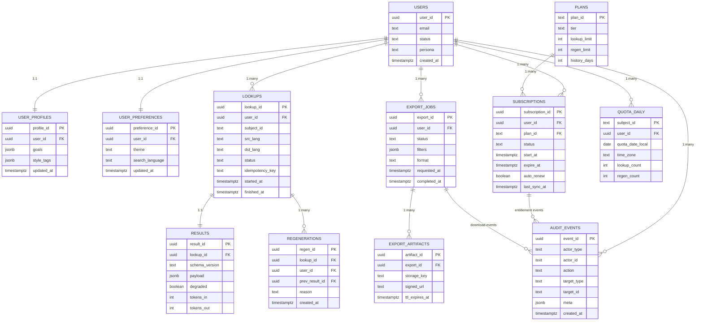

# 第 9 章 数据模型与数据治理

## 9.1 目标与范围

定义 Glancy 在 MVP 阶段的核心数据域、逻辑与物理数据模型、数据全生命周期与留存策略、数据质量与访问治理、契约版本与变更流程，确保与前述功能、配额、历史留存、无痕查询、导出与合规要求一致。本文以既有“语言对白名单、分层档位、历史留存与删除语义、结构化契约”等条款为约束前提制定。

## 9.0 对齐结果（T03，2025-02）

> 本节对照当前生产代码与原 SRS 目标，供后续重构参考。9.1 之后保留原 SRS 文字作为“目标模型”。

> **ER 图（核心实体）**：FigJam [node 230-80](https://www.figma.com/file/glancy-sdd-figjam?type=whiteboard&node-id=230-80#ERCore) / Mermaid 源 [`doc/图/src/er-core.mmd`](../图/src/er-core.mmd)。



### 9.0.1 当前实现表（实体 / 表）

| 数据域 | 实体 / 表 | 关键字段 & 行为 | 溯源 |
| --- | --- | --- | --- |
| 通用 | `BaseEntity` | Long 自增主键、`deleted`（软删布尔）、`createdAt`/`updatedAt`（`@CreatedDate/@LastModifiedDate`） | [BaseEntity](../../backend/src/main/java/com/glancy/backend/entity/BaseEntity.java) |
| 账户 | `users` | `username`、`email`、`phone`（唯一）、`member` flag、`membershipType`、`membershipExpiresAt`、`loginToken`、`lastLoginAt`；无 `plan_id`/`time_zone` 列 | [User](../../backend/src/main/java/com/glancy/backend/entity/User.java) |
| 画像 | `user_profiles` | 1:1 用户画像，列包括 `job/interest/goal/education/current_ability/daily_word_target/future_plan/response_style/custom_sections(TEXT)` | [UserProfile](../../backend/src/main/java/com/glancy/backend/entity/UserProfile.java)，[UserProfileService](../../backend/src/main/java/com/glancy/backend/service/UserProfileService.java) |
| 偏好 | `user_preferences` | 1:1 配置，`theme/system_language/search_language`，默认值在 `UserPreferenceService` 中写入 | [UserPreference](../../backend/src/main/java/com/glancy/backend/entity/UserPreference.java)，[UserPreferenceService](../../backend/src/main/java/com/glancy/backend/service/UserPreferenceService.java) |
| 快捷键 | `user_keyboard_shortcuts` | `user_id` + `action` 与 `user_id` + `binding` 双唯一约束；`binding` 为 `MOD+SHIFT+F` 等规范串 | [UserKeyboardShortcut](../../backend/src/main/java/com/glancy/backend/entity/UserKeyboardShortcut.java)，[KeyboardShortcutService](../../backend/src/main/java/com/glancy/backend/service/shortcut/KeyboardShortcutService.java) |
| 词条缓存 | `words` + `word_*` element collections | 双唯一键 (`term,language,flavor` 与 `normalized_term,language,flavor`)，JSON 字段由 DTO 直接映射；无 `schema_version/tokens` | [Word](../../backend/src/main/java/com/glancy/backend/entity/Word.java)，[WordCacheManager](../../backend/src/main/java/com/glancy/backend/service/word/WordCacheManager.java) |
| 搜索历史 | `search_records` | `user_id`、`term`、`language`、`flavor`、`favorite`、`deleted`；每日次数通过按日 `countByCreatedAtBetween` 计算，无持久化 quota | [SearchRecord](../../backend/src/main/java/com/glancy/backend/entity/SearchRecord.java)，[SearchRecordService](../../backend/src/main/java/com/glancy/backend/service/SearchRecordService.java) |
| 结果版本 | `search_result_versions` | `search_record_id`、`user_id`、`word_id`、`term`、`language`、`flavor`、`model`、`version_number`、`content(TEXT)`、`preview`；按记录自增版本号 | [SearchResultVersion](../../backend/src/main/java/com/glancy/backend/entity/SearchResultVersion.java)，[SearchResultService](../../backend/src/main/java/com/glancy/backend/service/SearchResultService.java) |
| 词条问题 | `word_issue_reports` | `term`、`language`、`flavor`、`category`、`description`、`source_url`、`user_id`；无状态流转列 | [WordIssueReport](../../backend/src/main/java/com/glancy/backend/entity/WordIssueReport.java)，[WordIssueReportService](../../backend/src/main/java/com/glancy/backend/service/WordIssueReportService.java) |
| TTS 用量 | `tts_usage` | 唯一键 `(user_id, date)`；记录今日 count；但 `TtsQuotaService` 尚未在 `TtsController` 中调用 | [TtsUsage](../../backend/src/main/java/com/glancy/backend/entity/TtsUsage.java)，[TtsQuotaService](../../backend/src/main/java/com/glancy/backend/service/tts/quota/TtsQuotaService.java) |
| 兑换 | `redemption_codes` + `redemption_records` | 兑换码包含 `total_quota/per_user_quota/effect_type/membership_type/membership_extension_hours/discount_*`；兑换记录 `code_id/user_id/redeemed_at` | [RedemptionCode](../../backend/src/main/java/com/glancy/backend/entity/redemption/RedemptionCode.java)，[RedemptionRecord](../../backend/src/main/java/com/glancy/backend/entity/redemption/RedemptionRecord.java)，[RedemptionCodeService](../../backend/src/main/java/com/glancy/backend/service/redemption/RedemptionCodeService.java) |

### 9.0.2 目标契约表（原 SRS 摘要）

| 数据域 / 章节 | SRS 约定 | 当前状态 | Issue |
| --- | --- | --- | --- |
| 账户与订阅域（9.2） | `plans`、`subscriptions`、`auth_identities`，并区分 `plan_id`、`status`、`time_zone` | 未建任何 `plans/subscriptions` 表；订阅状态仅存于 `users` | ISSUE#T03-DATA-01 |
| 词典与生成（9.4–9.5） | `lookups/results/regenerations` 三张主表，含 `schema_version/tokens_in/tokens_out/profile_snapshot/idempotency_key` | 仅 `search_records` + `search_result_versions` + `words`，字段远少于 SRS | ISSUE#T03-DATA-02 |
| 配额与限流（9.2 / 9.5.2） | `quota_daily`、`rate_limits`、`tokens_in/out` 汇总表 | 无落库表；配额通过实时 `count(*)` 计算，TTS quota 未接入 | ISSUE#T03-DATA-03 |
| 历史与导出（9.2） | `history`、`export_jobs`、`deletion_tasks`、导出 TTL、逻辑/物理删除分层 | 仅 `search_records.deleted` 布尔，无导出/任务表 | ISSUE#T03-DATA-04 |
| 观测与审计域 | `audit_events`、`cost_counters` | 未落库任何审计/成本事件 | ISSUE#T03-DATA-05 |
| 数据分类/留存（9.3） | S2/S3 字段脱敏、留存 SLA、冷存策略 | 邮箱/手机号等 PII 直接存储，未标注分级，也无留存配置 | ISSUE#T03-DATA-06 |

### 9.0.3 Issues（数据模型）

- **ISSUE#T03-DATA-01**：订阅/计划数据模型缺失，会员信息仅存 `users.membershipType`。需按 SRS 9.2 增加 `plans`、`subscriptions`、`auth_identities`，同步 11 章订阅流程。
- **ISSUE#T03-DATA-02**：`lookups/results/regenerations` 未实现，查词上下文、模块/令牌/幂等键等字段无法追溯。现有 `search_records` 仅保存文案。
- **ISSUE#T03-DATA-03**：`quota_daily/rate_limits` 表缺失，配额与限速无持久化凭证，难以审计。`TtsUsage` 虽存在却未挂载到业务流程。
- **ISSUE#T03-DATA-04**：历史导出/物理删除编排（`export_jobs/deletion_tasks`）未落地，SRS 8.5/9.5 要求的删除回执无法实现。
- **ISSUE#T03-DATA-05**：无 `audit_events`/`cost_counters`，难以满足 9.2 观测域与 10.7 成本护栏。
- **ISSUE#T03-DATA-06**：数据分级/留存策略未执行，PII 列没有脱敏/TTL，需补充 `time_zone`、`soft_deleted_at` 等列及清理策略。

### 9.0.4 现状 ER 摘要

- `users (1)` — `search_records (n)` — `search_result_versions (n)`；版本可选关联 `words`（缓存词条）。参见 [SearchResultService](../../backend/src/main/java/com/glancy/backend/service/SearchResultService.java)。
- `users (1)` — `user_profiles (1)` / `user_preferences (1)` / `user_keyboard_shortcuts (n)`。
- `redemption_codes (1)` — `redemption_records (n)`；兑换后通过 [MembershipLifecycleService](../../backend/src/main/java/com/glancy/backend/service/membership/MembershipLifecycleService.java) 更新 `users`。
- `word_issue_reports` 仅记录用户上报，无后续处理状态。
- `tts_usage` 以 `(user_id,date)` 为键，用于每日合成计数，但 controller 未调用 `TtsQuotaService.verifyQuota/recordUsage`。

------

## 9.2 数据域与所有权（Data Domains & Ownership）

| 数据域       | 范围                                     | 主责角色         | 关键实体                                             |
| ------------ | ---------------------------------------- | ---------------- | ---------------------------------------------------- |
| 账户与订阅域 | 用户身份、第三方登录、订阅状态与档位矩阵 | 平台后端负责人   | `users`、`auth_identities`、`plans`、`subscriptions` |
| 词典与生成域 | 查词请求、生成配置、结构化结果、再生成   | 生成服务负责人   | `lookups`、`results`、`regenerations`、`profiles`    |
| 配额与限流域 | 日配额、再生成配额、并发与突发计数       | 平台后端负责人   | `quota_daily`、`rate_limits`                         |
| 历史与导出域 | 历史留存、清理与导出任务                 | 数据工程负责人   | `history`、`export_jobs`、`deletion_tasks`           |
| 观测与审计域 | 调用链路、成本与令牌统计、审计日志       | 运维与合规负责人 | `audit_events`、`cost_counters`                      |

------

## 9.3 数据分类与分级

### 9.3.1 数据分类

- **业务数据**：账户、订阅、画像、查词与结果、历史与导出。
- **观测数据**：trace、tokens_in/out、错误码、延迟分段、缓存命中。
- **元数据**：契约版本、字段词汇表、质量规则与阈值。

### 9.3.2 分级与保护（示例）

| 等级    | 描述                           | 保护措施                                 |
| ------- | ------------------------------ | ---------------------------------------- |
| S0 公开 | 产品静态配置（非敏感）         | 常规访问                                 |
| S1 内部 | 模块开关、详略级别等偏好       | 访问控制、审计                           |
| S2 受限 | 邮箱、第三方 UID、查词词条     | 传输与存储加密、列级脱敏、最小留存       |
| S3 敏感 | 账单标识、订单号、导出下载链接 | 加密、最小权限、一次性链接 TTL=10 分钟（见第 8 章导出契约）、审计强制 |

> PII 清单：邮箱、手机号（若有）、第三方账号 ID、IP、设备标识。导出文件含结构化结果时视作 S3。

------

## 9.4 逻辑数据模型（LDM）

### 9.4.1 核心实体与关系

- **User 1..n Subscription**：用户可有多个订阅记录，状态机含 Active/Grace/Expired。
- **User 1..n Profile**：画像随用户演进，查词时拍快照用于可追溯。
- **User 1..n Lookup 1..1 Result**：一次查词对应一条结构化结果；再生成产生新的 `Result` 并与 `Regeneration` 事件关联。
- **User 1..n QuotaDaily**：按“用户本地自然日”维度累计查词与再生成。
- **Lookup 1..n Regeneration → Result**：再生成链保留前后版本与差异摘要。
- **ExportJob/DeletionTask**：异步导出与延迟物理清理的编排对象。
- **AuditEvent**：关键操作与访问的不可篡改记录。

------

## 9.5 物理数据模型（PDM，OLTP）

### 9.5.1 通用约定

- **数据库**：PostgreSQL（示例类型）；时区统一 UTC；主键 `uuid`。
- **命名**：表/列 `snake_case`；JSON 契约字段 `camelCase`。
- **审计列**：`created_at`、`updated_at`、`soft_deleted_at`（为空表示未逻辑删除）。
- **契约版本**：API 响应字段 `schemaVersion = 'glancy.dict.v1'`，落库列 `schema_version` 保持同值。
- **幂等键**：`idempotency_key = hash(subject_id + lang_pair + entry_norm + config_hash + profile_etag)`。

### 9.5.2 关键表结构（节选）

```sql
-- 用户
create table users (
  user_id uuid primary key,
  email text unique,             -- S2
  locale text not null default 'zh',
  time_zone text not null,             -- 首次登录写入真实时区
  created_at timestamptz not null,
  updated_at timestamptz not null,
  soft_deleted_at timestamptz
);

-- 订阅与档位
create table plans (
  plan_id text primary key,      -- 'free'|'plus'|'pro'
  daily_lookup_limit int not null,
  daily_regen_limit int not null,
  history_default_days int not null,
  history_max_count int not null,
  style_tags_limit int not null,
  concurrency_tier text not null
);

create table subscriptions (
  subscription_id uuid primary key,
  user_id uuid references users(user_id),
  plan_id text references plans(plan_id),
  status text not null,          -- Active|Grace|Expired
  provider text not null,        -- 'wechat'|'apple'|'google' 等
  external_order_id text,        -- S3
  start_at timestamptz not null,
  expire_at timestamptz not null,
  auto_renew boolean not null default false,
  last_sync_at timestamptz,
  created_at timestamptz not null,
  updated_at timestamptz not null
);

-- 用户画像（当前有效版本）
create table profiles (
  profile_id uuid primary key,
  user_id uuid references users(user_id),
  goals text[] not null,         -- 考试/学术/职场/旅行/日常/阅读/写作
  domains text[] not null,       -- 专业背景
  proficiency jsonb,             -- {cefr:'B2', ielts:{...}, toefl:{...}, cet:..., self:7}
  style_tags text[] not null,    -- 档位限制数量
  language_pairs text[] not null,-- 来自白名单
  created_at timestamptz not null,
  updated_at timestamptz not null
);

-- 查词请求（含快照）
create table lookups (
  lookup_id uuid primary key,
  subject_id text not null,                -- u_<userId> 或 s_<sessionId>
  user_id uuid references users(user_id),
  entry text not null,                   -- 词或词组（S2）
  src_lang text not null,
  dst_lang text not null,
  is_same_lang boolean not null,
  is_incognito boolean not null default false,
  profile_snapshot jsonb not null,       -- 画像快照（含受限字段最小化）
  ui_config jsonb not null,              -- 模块开关/顺序/详略级别
  idempotency_key text not null,         -- 唯一索引
  trace_id text not null,
  served_from_cache boolean not null default false,
  model_id text not null,                -- 使用的 Doubao 型号
  started_at timestamptz not null,
  finished_at timestamptz,
  status text not null,                  -- success|failed|degraded
  error_code text,
  created_at timestamptz not null,
  updated_at timestamptz not null,
  unique (subject_id, idempotency_key)
);

-- 结构化结果（契约版本化）
create table results (
  result_id uuid primary key,
  lookup_id uuid references lookups(lookup_id) unique,
  schema_version text not null,          -- 'glancy.dict.v1'
  payload jsonb not null,                -- 释义/例句/搭配/同反义/派生
  detail_level text not null,            -- short|medium|long
  modules jsonb not null,                -- 渲染模块状态及排序
  tokens_in int not null default 0,
  tokens_out int not null default 0,
  truncated boolean not null default false,
  created_at timestamptz not null
);

-- 再生成事件
create table regenerations (
  regen_id uuid primary key,
  subject_id text not null,                -- 与 lookups.subject_id 一致
  user_id uuid references users(user_id),
  lookup_id uuid references lookups(lookup_id),
  prev_result_id uuid references results(result_id),
  new_result_id uuid references results(result_id),
  reason text,                            -- 更简单/更难/风格切换等
  created_at timestamptz not null
);

-- 日配额（按用户本地自然日）
create table quota_daily (
  subject_id text not null,
  user_id uuid references users(user_id),
  quota_date_local date not null,    -- 用户本地自然日截点（与 time_zone 联动）
  time_zone text not null,           -- 落库用户时区以供审计/存证
  lookup_count int not null default 0,
  regen_count int not null default 0,
  primary key (subject_id, quota_date_local)
);

-- 审计事件（不可篡改）
create table audit_events (
  event_id uuid primary key,
  actor_type text not null,               -- user|system|staff
  actor_id text,                          -- user_id 或服务名
  action text not null,                   -- login/exports/download/delete 等
  target_type text not null,              -- user|lookup|result|subscription
  target_id text,
  meta jsonb,                             -- 仅保留必要元数据，避免落敏感原文
  created_at timestamptz not null
);
```

> 说明：`history` 可实现为 `lookups` 的视图与策略（策略决定哪些记录对用户可见），并辅以 `history_index` 物化视图优化分页；`export_jobs`、`deletion_tasks` 为标准异步编排表，包含 `status`、`attempts`、`error`、`ready_at` 等常规列。

### 9.5.3 审计事件动作枚举与示例

- **动作枚举**：`login`、`logout`、`export.requested`、`export.downloaded`、`export.deleted`、`history.deleted`、`plan.changed`（订阅切换）。
- **最小可追溯字段**：`actor_type`（user/system/staff）、`actor_id`（用户或服务主体）、`action`、`target_type`、`target_id`、`meta` 内部约定键。

| 动作 (`action`)        | 必填字段                                      | `meta` 最小键示例                          | 说明 |
| ---------------------- | --------------------------------------------- | ------------------------------------------ | ---- |
| `export.requested`     | `actor_type=user`、`actor_id`、`target_type=export_job`、`target_id` | `filters`（脱敏条件摘要）、`format`、`trace_id` | 记录发起导出与过滤条件（摘要），供回放契约。 |
| `export.downloaded`    | `actor_type=user`、`actor_id`、`target_type=export_job`、`target_id` | `download_url_id`、`ip`、`user_agent_hash` | 追溯一次性链接的实际下载，支持 10 分钟 TTL 抽检。 |
| `export.deleted`       | `actor_type=system`、`target_type=export_job`、`target_id` | `reason`（如 TTL 过期/用户撤销）、`deleted_at` | 说明导出产物清理路径，符合 S3 最小留存。 |
| `history.deleted`      | `actor_type=user|staff`、`actor_id`、`target_type=lookup`、`target_id` | `mode`（逻辑/物理）、`deletion_task_id`     | 对应 T+7 天物理清理流程，确保删除语义可审计。 |

> 枚举集合在数据库层使用 CHECK 约束或枚举型保障，`meta` 内部键值需遵循最小化原则，不落原文，仅存回执号与脱敏摘要。

------

## 9.6 结果 JSON 契约（`glancy.dict.v1` 摘要）

```json
{
  "schemaVersion": "glancy.dict.v1",
  "lookupId": "lk_123",
  "entry": "bank account",
  "langPair": { "source": "en", "target": "zh" },
  "sameLang": false,
  "modules": {
    "definitions": [
      {
        "senseId": "s_1",
        "pos": "n",
        "gloss": "a record of money held by a bank for a customer",
        "translation": "银行账户",
        "examples": [
          {
            "text": "I opened a new bank account.",
            "translation": "我新开了一个银行账户。",
            "difficulty": "original",
            "style": "daily"
          }
        ]
      }
    ],
    "collocations": ["open an account", "joint account"],
    "synonyms": ["checking account"],
    "antonyms": [],
    "derivations": ["banker", "banking"]
  },
  "detailLevel": "medium",
  "exampleCount": 1,
  "tokensIn": 321,
  "tokensOut": 512,
  "degraded": false,
  "degradeReason": null,
  "truncated": false
}
```

> 字段长度与详略级别遵循统一预算；同语模式不携带 `translation`。`schemaVersion` 常量值与第 8 章接口契约保持一致；`tokensIn/tokensOut` 为观测字段，对齐第 14 章成本与 SLO 看板。契约的破坏性变更需升级为 `glancy.dict.v2` 并走弃用期。

------

## 9.7 数据生命周期与留存策略

| 实体                        | 默认留存                                        | 档位差异与规则                           | 删除语义                              |
| --------------------------- | ----------------------------------------------- | ---------------------------------------- | ------------------------------------- |
| `lookups`/`results`（历史） | Free/Plus/Pro 留存口径以[第 11 章 订阅、计费与账单](<./第 11 章 订阅、计费与账单.md>)为准（示例：Free 10 天/100 条、Plus 90 天/1000 条、Pro 永久） | 超上限按时间滚动清理；无痕查询不落库内容 | 逻辑删除即时；物理清理延迟 7 天批处理 |
| `quota_daily`               | 180 天                                          | 仅保留计数与汇总，不含词条文本           | 到期物理清理                          |
| `audit_events`              | 365 天                                          | 合规要求可延长至 730 天                  | 冷存归档后清理                        |
| `export_jobs`               | 30 天                                           | 下载链接 TTL 10 分钟；一次性使用         | 到期物理清理                          |
| `subscriptions`             | 合同周期 + 365 天                               | 到期后保留核算所需最小字段               | 到期冷存                              |

无痕查询：`is_incognito=true` 时，不写入 `lookups/results/history` 正文，仅在 `quota_daily` 增加计数及观测指标，不记录 `entry` 原文。

------

## 9.8 数据质量（DQ）与校验

- **契约校验**：`results.schema_version` 必填；`payload` 必须满足 JSON Schema（CI 内置 500+ 回放样本校验）。
- **内容预算**：详略级别对应字符上限，超限触发 `truncated=true` 并保留完整可恢复副本于临时对象存储 ≤24h。
- **白名单校验**：`(src_lang, dst_lang)` 必须在语言对白名单中；同语模式不允许出现 `translation` 字段。
- **幂等与去重**：同一 `idempotency_key` 必须唯一；短期缓存命中率记录于观测数据。
- **外键完整性**：删除 `users` 触发级联逻辑删除并下发 `deletion_task`。

质量指标与阈值与“成功标准与关键指标”对齐（结构化输出正确率 ≥ 99%，导出回执 ≤ 5 s 等）。

------

## 9.9 元数据、血缘与数据目录

- **数据目录**：以表为粒度登记中文名、业务口径、敏感级别、责任人、上下游引用。
- **血缘**：`UI → API → lookups → results → history/exports` 全链路记录 `trace_id`；批处理产生的数据写入 `audit_events`。
- **Schema Registry**：维护 `glancy.dict.*` 契约版本及兼容矩阵；API 层在运行时校验版本并记录不兼容告警。

------

## 9.10 访问控制与脱敏

- **RBAC**：用户、客服、管理员、审计四级角色；客服只可经工单态查看脱敏视图。
- **行列权限**：按 `user_id` 行级过滤；列级：邮箱、订单号、下载链接对非必要角色脱敏。
- **脱敏视图示例**：

```sql
create view v_user_support as
select
  user_id,
  regexp_replace(email, '^(.).+(@.+)$', '\1***\2') as email_masked,
  locale, time_zone, created_at
from users;
```

------

## 9.11 配额与限流口径实现

- **日配额**：`quota_daily` 以“用户本地自然日”为唯一口径；写入时使用 `users.time_zone`（首次登录写入真实时区，匿名会话使用浏览器时区估算）计算 `quota_date_local`，并落库到 `quota_daily.time_zone` 以供审计存证与重算。
- **限速**：用户级 → 租户级 → 全局级层层拦截；超限返回 429 与冷却时间。

------

## 9.12 变更管理与版本策略

- **数据库迁移**：以迁移脚本分批上线；涉及大表新增列默认值使用异步回填。
- **契约版本**：采用语义化版本；不兼容变更需提供弃用期与双写方案（`v1` 与 `v2` 并存），灰度按流量百分比分阶段切换。
- **回放与验收**：发布前使用≥500 条契约样本自动回归。

------

## 9.13 导出与删除编排

- **导出**：`export_jobs` 记录过滤条件、格式（CSV/JSON）、回执号、一次性下载 URL 与 TTL=10 分钟；完成后写 `audit_events`。
- **删除**：逻辑删除即时可见；`deletion_tasks` 在 7 天后执行物理清理，清理前可恢复。

------

## 9.14 指标与成本核算

- **计量**：`results.tokens_in/out` 记录模型用量；`cost_counters` 按模型与地区聚合；含重试分摊。
- **可观测**：端到端 P95、平均延迟、错误率、缓存命中率等写入观测系统，触发告警与抑制策略。

------

## 9.15 安全与合规要点（与[第 12 章 安全、隐私与合规](<./第 12 章 安全、隐私与合规.md>)联动）

- **加密**：传输 TLS，存储列级或透明加密；导出文件加签并限时。
- **最小化**：无痕查询不落正文；常规查询仅保存结构化必要字段，避免原始提示词与上下文冗余落库。
- **审计**：角色变更、导出下载、删除恢复等均落 `audit_events` 并定期归档。

> 至此，数据模型与数据治理与既有功能、配额、留存、导出、合规条款闭环，满足 MVP 可落地与可验收目标。
